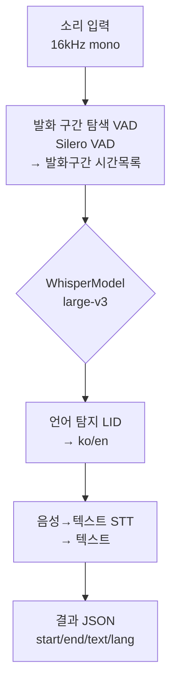

:::note
💡 이 글은 음성을 글자 변환  (Speech to Text) 하는 과정을 구체적으로 명시한 글이다
:::

<!--truncate-->

음성 분석 과정을 가장 쉽게 요약하면

1. 소리를 입력
1. 사람 말하는 구간 탐색 (VAD)
1. WhisperModel 도입
   1. 소리를 텍스트로 변환 (STT)

   1. 어떤 언어인지 탐지 (LID)

1. 결과 json 으로 변환

이 정도다.





최적화를 위한 여러 라이브러리가 존재하는 것을 파악하였고, 최종 Flow를 아래와 같이 하였다.

```bash
# worker-prep_stt/main.py

run()
 ├ 0) _load_audio       오디오 로드 및 denoise
 ├ 1) vad.detect        발화 구간 (Silero VAD)
 ├ 1b) speaker.diarize  화자 구분 (pyannote)
 ├ 2) _classify_languages  구간별 언어 판정 (LID)
 ├ 3) _transcribe_batched  ◀── 여기가 진짜 음성→텍스트 (ASR)
 ├ 4) _assemble_segments   단어→문장 재조립 + 화자 매핑
 └ 5) json 저장
```


그 중 발화 구간, 화자 구분, 언어 판정, ASR 과정을 각각 살펴보겠다

---

#### 1. 발화 구간 추출 (VAD)

- 간단히 요약하면, **사람이 말하는 부분을 추출하는 공간** 이다.

```python
 model="silero_vad"

 # lib/audio/vad.py
 
def detect(audio_np: np.ndarray, sr: int = 16000) -> list[tuple[float, float]]:
    """발화 구간 타임스탬프 추출.

    audio_np : float32 1D numpy (16kHz 권장)
    sr       : 샘플레이트 (Silero VAD 는 16k / 8k 만 공식 지원)

    Returns: [(start_sec, end_sec), ...]  — 발화 구간 (정렬됨)
    """

    audio_t = torch.from_numpy(audio_np).float()
    ts_list = _get_speech_timestamps(
        audio_t, _model, sampling_rate=sr,
        min_speech_duration_ms=int(MIN_SPEECH_S * 1000),
        max_speech_duration_s=MAX_SPEECH_S,
        min_silence_duration_ms=int(MIN_SILENCE_S * 1000),
    )
    return [(t["start"] / sr, t["end"] / sr) for t in ts_list]
    
    

```

- 사람이 말하는 구간을 찾아내고, 샘플링 레이트를 16kHz 로 설정시키는 과정
  - Silero VAD가 **샘플 번호** 로 주는 걸, `÷16000` 해서 **초 단위** 로 바꿔 반환

- 구체적 입출력
  ```python
  입력:  [침묵····말·······침묵··말말····침묵]  ← 소리 배열         # np.ndarray (float32 1D)
  출력:  [(2.1,5.8), (40.3,47.2), ...]         ← 말하는 구간 시각만 # list[tuple[float, float]]
  ```

---

#### 2. 화자 분리

- 하나의 영상에는 다양한 사람이 나오고, 그 사람들의 목소리는 당연히 다르다. 
- **이번엔** **화자를 구분 시키는 부분** 이다. 오픈소스 라이브러리.  pyannotate 도입하였다.

```python
 PYANNOTE_DIARIZE =  "pyannote-diarization"  # 화자 구분 (community-1, self-contained)
 
 # lib/audio/speaker.py

 def diarize(audio_np: np.ndarray, sr: int = 16000) -> list[tuple[float, float, str]]:
    """화자 턴 타임라인 추출.

    audio_np : float32 1D numpy (16k mono)
    Returns  : [(start_s, end_s, speaker_label), ...]  (시간순)
    """
    #...
    
    waveform = torch.from_numpy(audio_np).unsqueeze(0).to(_device)
    out = _pipeline({"waveform": waveform, "sample_rate": sr})
    # pyannote 4.x: DiarizeOutput.speaker_diarization 이 Annotation
    turns = [
        (turn.start, turn.end, speaker)
        for turn, _, speaker in out.speaker_diarization.itertracks(yield_label=True)
    ]
    log.info(f"diarization: {len(turns)} turns, {len(set(t[2] for t in turns))} speakers")
    return turns
```


- 구체적 입출력
  ```python
  입력: 오디오 전체, 16kHz Float 배열
  
  출력: 화자 구분
  [
      (0.0,   5.8,  "SPEAKER_00"),   # 0~5.8초: 화자0
      (5.8,   12.3, "SPEAKER_01"),   # 5.8~12.3초: 화자1
      (12.3,  15.0, "SPEAKER_00"),   # 다시 화자0
      (40.3,  47.2, "SPEAKER_02"),   # 화자2
      ...
  ]
  ```

---


Whisper-large-v3는 OpenAI에서 공개한 최신 음성 인식 모델로, 

다국어 음성 인식, 자동 자막 생성, 오디오 텍스트 변환 등의 작업에서 뛰어난 성능을 발휘하여, 도입하게 되었다. 


#### 3. 언어 판정 (LID)

- 어떤 언어인지를 식별하는 과정이다.

```python
MODEL : "whisper-large-v3"
COMPUTE_TYPE : "float16" # GPU 서버이기에 COMPUTE_TYPE 은 float16 선정

 # lib/audio/whisper.py

def detect_language(chunk: np.ndarray) -> tuple[str, float]:
    """raw chunk → (lang_code, prob). LID 는 raw 오디오에서 (PoC Strategy 2)."""

    lang_code, prob, _all_probs = _model.detect_language(chunk)
    return lang_code, prob

```

- wav 음성 파일 LID 과정.
  -  ko=1.00 → 가장 높은 확률로 ko 로 인식한다는 뜻이다.

- 두 모델 (Whisper LID / VoxLingua107 LID) 비교하였다.

```python
2026-05-28 18:35:21 [INFO] lid_bench: DeepFilterNet3 loaded (sr=48000, device=cuda:0)
2026-05-28 18:35:21 [INFO] lid_bench: Loading Silero VAD...
2026-05-28 18:35:21 [INFO] lid_bench: Loading Whisper LID: mobiuslabsgmbh/faster-whisper-large-v3-turbo
2026-05-28 18:35:22 [INFO] lid_bench: Loading VoxLingua107 LID (savedir=/stg/models/voxlingua107)
2026-05-28 18:35:22 [INFO] lid_bench: === models loaded ===
2026-05-28 18:35:22 [INFO] lid_bench: === bench start: /stg/vod/scenemaker/sound_full/docu.wav ===
2026-05-28 18:35:23 [INFO] lid_bench: denoise chunked: 3520.7s → 118 chunks of 30s
2026-05-28 18:35:33 [INFO] lid_bench: denoise saved: output/denoise/docu.wav
2026-05-28 18:35:43 [INFO] lid_bench: audio 3520.7s → VAD 383 speech segments
2026-05-28 18:35:44 [INFO] lid_bench: [  11.5~  12.7s] W-raw=ko=1.00  V-raw=ko=0.99  W-den=ko=1.00  V-den=ko=0.80
2026-05-28 18:35:44 [INFO] lid_bench: [  13.1~  15.3s] W-raw=ko=1.00  V-raw=ko=1.00  W-den=ko=1.00  V-den=ko=1.00
...
026-05-28 18:35:45 [INFO] lid_bench: [ 278.4~ 281.1s] W-raw=ko=1.00  V-raw=ko=1.00  W-den=ko=1.00  V-den=ko=1.00
2026-05-28 18:35:45 [INFO] lid_bench: [ 282.6~ 284.3s] W-raw=en=0.30  V-raw=it=0.79  W-den=en=0.46  V-den=pt=0.32
```

#### 4. 음성 인식 

```python
 MODEL : "whisper-large-v3"
 COMPUTE_TYPE : "float16"
 BATCH_SIZE=16
 
 # lib/audio/whisper.py


def transcribe_batched(audio: np.ndarray, language: str) -> list[dict]:
    """오디오를 지정 언어로 배치 transcribe (내부 VAD 로 발화 구간만, 30s 윈도우 병렬).

    audio 는 보통 "해당 언어 외 구간을 묵음 처리한 전체 길이 스트림" → 내부 VAD 가
    묵음을 건너뛰므로 그 언어 발화만 인식되고, timestamp 는 원본 시각 그대로.

    word_timestamps 로 단어 단위 반환 → 호출측(stt_service)이 화자 턴/문장부호 기준으로
    재분할 (배치는 segment 가 30s 로 뭉치므로 세밀도/화자 정확도 복원).

    Returns: [{"start", "end", "word", "seg_logprob"}, ...]  (단어 단위, 절대 시각)
             seg_logprob = 그 단어가 속한 segment 의 avg_logprob (환각 필터용)
    """
    if _model is None:
        load_model()
    segments_gen, _info = _batched.transcribe(
        audio,
        language=language, 
        batch_size=BATCH_SIZE,          # 동시에 GPU 올리는 3-s 윈도우 수, 16 으로 설정함
        beam_size=5,
        no_speech_threshold=0.6,
        log_prob_threshold=-1.0,
        compression_ratio_threshold=2.4,
        condition_on_previous_text=False,
        repetition_penalty=1.2,
        no_repeat_ngram_size=3,
        vad_filter=True,        # 묵음 구간 건너뛰기 (묵음 스트림 처리의 핵심)
        word_timestamps=True,   # 단어 단위 타임스탬프
    )
    words = []
    for s in segments_gen:
        for w in (s.words or []):
            words.append({
                "start": float(w.start), "end": float(w.end),
                "word": w.word, "seg_logprob": s.avg_logprob,
            })
    return words
```


- 동작 과정 기록만 되어 있는 상태. 
  ```python
  2026/06/25 17:15:31 INFO [stt_service.py:_transcribe_batched:204] - batched [zh]: 81 words from 7 ranges
  2026/06/25 17:15:31 INFO [transcribe.py:transcribe:390] - Processing audio with duration 58:40.749
  2026/06/25 17:15:34 INFO [transcribe.py:transcribe:458] - VAD filter removed 58:38.445 of audio
  2026/06/25 17:15:34 INFO [stt_service.py:_transcribe_batched:204] - batched [vi]: 11 words from 1 ranges
  2026/06/25 17:15:34 INFO [stt_service.py:_assemble_segments:252] - assemble: 314 segments from 2477 words
  2026/06/25 17:15:34 INFO [util.py:write_json:26] - wrote json → output/2/result.json

  ...
  ```

- json 으로 결과 확인 가능하다.
  ```json
    {
      "idx": 0,
      "start": "00:00:07.2",
      "end": "00:00:09.9",
      "text": "스포일러 엄청 커 저번이랑",
      "lang": "ko",
      "speaker": "S003"
    },
  ```

---


목표였던 STT 및 정형화 과정이 완료되었다.

추출 내용 결과, 보정 필요 확인하였으며,  재보정 (refine) 진행할 예정이다. 


참고 링크) 

- [https://www.saytowords.com/ko/blogs/Faster-Whisper-Guide/](https://www.saytowords.com/ko/blogs/Faster-Whisper-Guide/)
- [https://elice.io/ko/resources/blog/whisper-large-benchmark](https://elice.io/ko/resources/blog/whisper-large-benchmark)
- [https://kjh1337.tistory.com/3](https://kjh1337.tistory.com/3)


