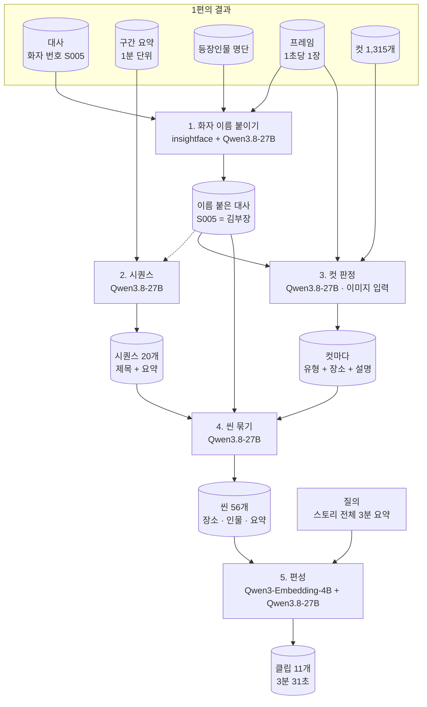

### 들어가며

---

1편에서 SBS 드라마 「김부장」 10편을 대사와 컷으로 쪼갰다. 이 글은 그 뒤, 숏폼이 실제로 나오기까지를 다룬다.

<!--truncate-->

1편이 끝났을 때 남은 문제는 두 가지였다.

- 음성 쪽은 "김부장" 이라는 이름을 알고, 화면 쪽은 "안경 쓴 정장 남자" 라는 외형만 안다. **둘이 연결되지 않았다.**
- 컷 1,315개를 씬으로 묶는 **방법을 정하지 못했다.**

2차 버전(2026-09-30 \~)은 이 둘을 풀고, 그 위에 "질의 한 줄로 숏폼 만들기" 를 올렸다.

바뀐 점을 가장 쉽게 요약하면 아래와 같다.

1. 화자 번호에 배역 이름 붙이기 (**신규** )
2. 회차를 사건 단위로 나누기 — 시퀀스 (**신규** )
3. 컷 판정에 "장소" 추가 (**변경** )
4. 시퀀스 안에서 컷을 씬으로 묶기 (**재설계** )
5. 질의로 씬을 골라 클립 목록 만들기 — 편성 (**신규** )

1편의 결과(대사·구간 요약·명단·프레임) 위에서 아래 순서로 돈다.

```bash
# 1편 이후 처리 순서

python main.py 1027                       # 화자 이름 붙이기
 ├ 1) candidates            인물 후보 뽑기            (Qwen3.8-27B)
 ├ 1) faces                 얼굴 검출 + 군집           (insightface buffalo_l)
 ├ 1) split                 화자를 화면 얼굴로 쪼개기   (규칙)
 └ 1) match                 단위마다 이름 확정         (Qwen3.8-27B, 3회 투표)

POST /api/v1/analyze  {v_id:1027, stream_id:"VOD", force:true}
 ├    컷 분할               (1편과 같음)
 ├ 2) 시퀀스                대사 요약 → 사건 단위      (Qwen3.8-27B)
 ├ 3) 컷 판정               화면 유형 + 장소 + 설명    (Qwen3.8-27B, 이미지)
 └ 4) 씬 묶기               컷 → 씬                    (Qwen3.8-27B)

POST /api/v1/compose  {query:"스토리 전체 3분 요약", budget_sec:180}
 └ 5) 편성                  씬 검색 → 선곡 → 구간 → 분량  (Qwen3-Embedding-4B, Qwen3.8-27B)
```

그림으로 나타내면 아래와 같다.



단계별로 사용한 모델이다.

| 단계 | 모델 | 입력 |
| --- | --- | --- |
| 1) 인물 후보·이름 매칭 | `Qwen3.8-27B-FP8` | 글자 |
| 1) 얼굴 검출·임베딩 | `insightface buffalo_l` | 이미지 |
| 2) 시퀀스 | `Qwen3.8-27B-FP8` | 글자 |
| 3) 컷 판정 | `Qwen3.8-27B-FP8` | 이미지 + 글자 |
| 4) 씬 묶기 | `Qwen3.8-27B-FP8` | 글자 |
| 5) 편성 — 장면 검색 | `Qwen3-Embedding-4B` | 글자 |
| 5) 편성 — 선곡·구간 | `Qwen3.8-27B-FP8` | 글자 |

1편과 마찬가지로 언어 모델은 `Qwen3.8-27B-FP8` 하나다. 새로 들어온 모델은 얼굴 인식(`buffalo_l` )과 임베딩(`Qwen3-Embedding-4B` ) 둘이다.

10편을 다 돌린 결과는 아래와 같다.

| 회차 | 대사 | 이름 붙은 대사 | 확정된 인물 | 시퀀스 | 씬 |
| --- | --- | --- | --- | --- | --- |
| 01 | 370줄 | 213줄 | 6명 | 20개 | 56개 |
| 02 | 311줄 | 108줄 | 5명 | 13개 | 61개 |
| 03 | 307줄 | 123줄 | 4명 | 15개 | 78개 |
| 04 | 230줄 | 11줄 | 1명 | 9개 | 59개 |
| 05 | 248줄 | 208줄 | 10명 | 9개 | 55개 |
| 06 | 280줄 | 218줄 | 8명 | 11개 | 60개 |
| 07 | 282줄 | 208줄 | 6명 | 10개 | 51개 |
| 08 | 297줄 | 121줄 | 4명 | 11개 | 50개 |
| 09 | 270줄 | 197줄 | 7명 | 14개 | 71개 |
| 10 | 333줄 | 239줄 | 10명 | 10개 | 58개 |

컷 12,540개가 **씬 599개** 로 줄었다. 한 회차에 컷 1,250개 → 씬 60개, 20분의 1이다.

---

##### 1. 화자 이름 붙이기 (insightface, Qwen3.8-27B)

- 1편의 대사는 화자가 `S005` 같은 번호다. 이걸 "김부장" 으로 바꾼다.
- 목소리만으로는 부족하다. 화자 분리가 **다른 사람을 같은 번호로 묶는** 일이 있어서다.
- 그래서 **화면의 얼굴** 을 같이 본다. 4스텝이다.

```python
## poc-speaker-name/main.py

cands, text = candidates(video, dialogues, thinking)     # ① 인물 후보
fc = faces(config.MEDIA_DIR / str(v_id) / stream_id, ...)  # ② 얼굴 군집
units, text = split(dialogues, fc)                        # ③ 화자 쪼개기
result, text = match(dialogues, cands, units, thinking)   # ④ 이름 확정
```

**1-1. 인물 후보 뽑기**

- 1편에서 위키로 찾은 **명단** , 전체 줄거리, 대사를 LLM 에 주고 "이 회차에 나올 수 있는 사람" 을 전부 뽑는다.

```python
## poc-speaker-name/lib/speaker/candidate.py

_SYSTEM = """\
너는 한국 드라마 대본 분석가다. 주어진 자료만 근거로 답하고, 자료에 없는 이름은 만들지 않는다.
- 등장인물 목록의 이름은 모두 넣는다.
- 대사에서 직접 불리거나 언급된 이름과 호칭(사장님, 엄마, 형, 선생님 등)도 넣는다.
- 화자라벨(S000 같은 것)은 이름이 아니다. 후보에 넣지 않는다.
- 한 줄에 하나, 형식은 반드시 다음과 같다.
  이름 | 종류 | 출처 | 비고
  종류는 실명, 호칭 중 하나.
"""
```

- 1화 결과

```text
김부장 | 실명 | 목록+대사 | 남자주인공, 중소저축은행 직원, seq 42, 48, 114
상아   | 실명 | 목록+대사 | 중소저축은행 직원, 김부장의 동료, seq 55, 89, 90
김민지 | 실명 | 목록+대사 | 김부장의 외동딸, seq 16, 20, 21
성한수 | 실명 | 목록      | 태권도 금메달리스트, 무도인, 동네 태권도장 운영
주강찬 | 실명 | 목록      | 메인 빌런, 주학건설 대표
```

- "아빠", "부장님" 같은 **호칭** 은 이름이 아니라 단서로 따로 둔다.
  - 실명에 별칭으로 붙여 저장한다. 김부장 = 아빠, 부장님, 삼촌 …

**1-2. 얼굴 검출 + 군집**

- 1초당 1장 프레임 전부에서 얼굴을 찾고, 같은 얼굴끼리 묶는다.

```python
_MIN_SCORE, _MIN_SIDE = 0.6, 60       # 검출 점수 0.6 미만, 한 변 60px 미만은 버림
_THRESHOLD, _MIN_CLUSTER = 0.6, 15    # 코사인 거리 0.6 으로 묶고, 15장 미만 군집은 버림

## poc-speaker-name/lib/speaker/face.py

_app = FaceAnalysis(name="buffalo_l", allowed_modules=["detection", "recognition"],
                    providers=["CUDAExecutionProvider", "CPUExecutionProvider"])

def cluster(result: Faces) -> None:
    emb = np.stack([f.emb for f in result.items])
    labels = AgglomerativeClustering(n_clusters=None, metric="cosine", linkage="average",
                                     distance_threshold=_THRESHOLD).fit(emb).labels_
    sizes = Counter(labels.tolist())
    rank = {c: i for i, (c, n) in enumerate(sizes.most_common()) if n >= _MIN_CLUSTER}
```

- 1화 동작 기록

```python
2026-10-02 15:59:57 [INFO] lib.speaker.face: face: 4015장 → 얼굴 3530개 41s
2026-10-02 15:59:58 [INFO] lib.speaker.face: face: 군집 397개, 15개 이상 22개
```

- 군집 397개 중 **22개만** 쓴다. 15장도 안 나오는 얼굴은 엑스트라로 본다.
- 가장 많이 나온 얼굴이 `F0` , 그다음이 `F1` 이다.

**1-3. 화자 쪼개기**

- 화자 번호마다 "말할 때 화면에 가장 자주 나온 얼굴" 을 **대표 얼굴** 로 정한다.
- 그 화자가 말하는데 화면에 대표 얼굴이 없고 다른 얼굴만 있으면, 그 줄을 떼어낸다.

```text
S005 | 대표 얼굴 F0+F6 (59/74줄)
  279 → S005_F12 | 장면 2846~2923초 F12+F20 | 회장님이 불러셨어, 새꺄야. 남 실장, 왜 이래, 애들? ...
  280 → S005_F12 | 장면 2846~2923초 F12+F20 | 오라매 왔잖아. 스케줄이 바뀌었어. 다시 연락하지.
  281 → S005_F12 | 장면 2846~2923초 F12+F20 | 내가 오라면 오고 가라면 가는 똥개 새끼냐?
```

- `S005` 는 74줄 중 59줄에서 얼굴 `F0` 과 함께 나온다. `S005` = `F0` 이다.
- 그런데 47분대 대사 4줄은 화면에 `F12` , `F20` 만 있다.
  - 말투도 주인공과 다르다. 화자 분리가 **다른 사람** 을 `S005` 로 묶은 것으로 보인다.

  - 이 줄들을 `S005_F12` 로 떼어낸다.

- 얼굴이 하나도 안 잡힌 구간은 판단하지 않고 그대로 둔다.

**1-4. 이름 확정**

- 인물 후보, 화자 단위, 대사 전체를 LLM 에 주고 단위마다 이름을 정하게 한다.

```python
## poc-speaker-name/lib/speaker/match.py

_SYSTEM = """\
- 이름은 인물 후보 중 종류가 실명인 것만 쓴다.
- 근거는 다음 중 하나여야 한다. 호명 뒤 응답(누가 이름을 부르고 그 단위가 답함), 자기소개,
  관계 호칭. 말투나 내용만으로 추정하지 않는다.
- 확실하지 않으면 이름을 미정으로 쓴다. 후보에 없는 사람도 미정이다.
"""

def _vote(runs: list[dict[str, str]], labels: list[str]):
    need = len(runs) // 2 + 1                 # 3번 중 2번 이상
    for s in labels:
        tally = Counter(r.get(s, "미정") for r in runs)
        name, cnt = tally.most_common(1)[0]
        result[s] = name if name != "미정" and cnt >= need else "미정"
```

- 같은 질문을 **3번** 하고 과반이 같은 답을 낸 것만 받는다.
- 1화 투표 결과

```text
S002     | 김민지 | 김민지 3
S003     | 상아   | 상아 3
S004     | 성한수 | 성한수 3
S005     | 김부장 | 김부장 3
S005_F12 | 미정   | 미정 3        # 떼어낸 줄은 누군지 모른다 → 비워 둔다
S006     | 박진철 | 박진철 3
```

- 대사에 이름이 붙는다.

```text
seq  화자   이름     대사
16   S005   김부장   민지야, 일어나. 김민지.
41   S005   김부장   뭐 이거 법인 카드 내역인데요. 지난주 수요일 9만 5천 원이 중식비로 ...
45   S007            융통성 그냥 회식비로 처리해, 응?
```

- 얼굴에도 이름이 붙는다. 프레임마다 "누가 어디에 있는지" 가 남는다.

```text
초     얼굴   이름     위치(x1,y1,x2,y2)
625    F0     김부장   778,237,925,404
626    F0     김부장   766,196,903,385
```

- **결론**
  - 1화는 대사 370줄 중 213줄에 이름이 붙었다. 주인공 김부장이 70줄로 가장 많다.

  - 확실하지 않으면 비워 둔다. 틀린 이름보다 빈칸이 낫다.

- **한계**
  - 회차마다 차이가 크다. 10화는 333줄 중 239줄, 4화는 230줄 중 11줄이다.

  - 4화는 1편에서 찾은 명단이 유독 짧았던 회차다.

---

##### 2. 시퀀스 (Qwen3.8-27B)

- 1편에서는 컷 1,315개를 바로 씬으로 묶으려다 막혔다.
- 이번엔 **먼저 회차를 큰 사건 단위로 나눈다.** 이 단위가 시퀀스다.
- 화면은 보지 않는다. 1편에서 만든 **1분 단위 구간 요약** 만 읽고 나눈다.

```text
# 시퀀스 (t_sequence_drama)
seq         시퀀스 순번 (1부터, 시간순)
start_sec   시작 초 — 구간 요약 1분 창 경계
end_sec     끝 초
title       사건 제목 (15자 안팎)
summary     사건 요약 1~2문장 (배역명 사용)
```

- 경계가 **1분 단위** 다. 구간 요약이 1분 창이라 그 경계를 그대로 쓴다. 정밀한 경계는 다음 단계(씬)가 잡는다.
- 1화 결과 — 20개

```text
시작       끝         제목                              요약
00:04:00   00:10:00   민지의 아침 준비와 학교 등교        김부장이 딸 민지를 깨워 아침 식사와 등교를 재촉하고, ...
00:10:00   00:13:00   직장 내 카드 의혹과 선물 계획       김부장이 부지점장의 법인 카드 사용 내역에 의혹을 제기하고, ...
00:13:00   00:16:00   학교 내 주애리의 가방 자랑과 갈등   주애리가 한정판 가방을 자랑하며 친구들의 시선을 끌지만, ...
00:16:00   00:20:00   백화점 방문과 티셔츠 구매 설득      김부장과 상아가 백화점을 방문하여 ...
00:53:00   00:56:00   민지의 분노와 가출 선언             민지는 아버지의 비굴한 사과에 분노하며 가출을 선언하고, ...
```

- 67분이 20개 사건으로 정리된다. 한 사건이 2\~7분이다.
- **한계**
  - 이름이 안 붙은 화자는 번호가 그대로 요약에 나온다.

  - 예: "S007이 S005를 옷을 벗으라고 위협하고, S013이 S005가 북한 출신 이중간첩임을 공개한다."

##### 3. 컷 판정 — 장소 추가 (Qwen3.8-27B)

- 1편의 컷 판정은 **유형 + 설명** 을 냈다. 여기에 **장소** 가 추가됐다.
- 넣는 것은 그대로다. 컷의 첫 프레임 1장과 그 구간의 대사.
- 1화 결과

```text
시작        유형      장소                  설명
00:10:19.5  ACTION    삼성저축은행 사무실   안경 쓴 정장 남성이 서류를 들고 사무실 안을 걸어다니며 ...
00:10:22.7  DIALOGUE  저축은행 사무실       사무실 책상 앞에서 안경 쓴 남자가 서류를 들어 보이며 ...
00:10:25.5  DIALOGUE  저축은행 사무실       안경 쓴 남자가 사무실 책상 앞에 선 채로 ... 법인 카드 내역을 지적하며 이야기한다
00:10:36.7  CLOSEUP   저축은행 사무실       안경을 쓴 정장 남자가 ... 놀란 표정을 짓고 있다
```

- 장소는 **씬을 나누는 재료** 다.
  - 장소가 바뀌면 씬이 바뀐다. 컷 1,315개에 장소가 붙으면 "어디서 끊을지" 가 보인다.

- 1화에서 많이 나온 장소

| 장소 | 컷 수 |
| --- | --- |
| 학교 교실 | 111 |
| 저축은행 사무실 | 51 |
| 주차장 | 46 |
| 회식 중인 식당 | 42 |
| 학교 복도 | 38 |
| 사우나 | 35 |

- 유형도 늘었다. 1편의 7개에 `RECAP` (지난 이야기), `PREVIEW` (예고) 가 추가됐다.
- **한계**
  - 같은 곳인데 컷마다 표기가 다르다. "삼성저축은행 사무실" 과 "저축은행 사무실" 이 섞인다.

  - 컷을 한 장씩 따로 보기 때문이다. 글자가 같은지로 끊으면 안 되고, 다음 단계가 뜻으로 묶어야 한다.

  - 1,315컷 중 34컷은 장소가 비어 있다. (타이틀·검은 화면 등)

##### 4. 씬 묶기 (Qwen3.8-27B)

- 1편에서는 "컷 1,315줄을 잘게 자를까, 크게 뭉칠까" 사이에서 답을 못 찾았다.
- 이번엔 **시퀀스가 자르는 단위** 가 된다.
  - 시퀀스 하나(2\~7분) 안의 컷 설명·장소·대사를 LLM 에 주고, 그 안에서 씬을 나눈다.

  - 자르는 위치가 사건 경계라 조각마다 문맥이 온전하다.

```text
# 씬 (t_scene_drama)
scene_seq   씬 순번 (1부터, 시간순)
start_sec   씬 시작 초 (= 시작 컷의 초)
end_sec     씬 끝 초 (= 마지막 컷의 끝)
scene_type  MAIN(본편), FLASHBACK(회상), RECAP(지난 이야기), PREVIEW(예고), AD(광고), CREDIT(크레딧)
place       장소
speakers    화자 ID 목록 (대사 집계)
cast        인물 묘사 (LLM 추론)
summary     장면 요약
```

- 씬의 시작과 끝은 **컷 경계** 에 맞춘다. 시퀀스는 1분 단위로 러프했지만, 씬은 0.1초 단위 컷에 붙는다.
- 1화 결과 — 56개 (본편 51개)

```text
00:10:02 ~ 00:13:00  MAIN  삼성저축은행 사무실
  화자: S004,S005,S008,S007,S003
  인물: 안경 쓴 남자(김부장), 안경 쓴 남자(부지점장), 회색 상의 여자(상아)
  요약: 김부장이 부지점장의 법인 카드 사용 내역을 지적해 회식비 처리를 유도한 뒤, 딸 민지의 생일
        선물로 호신용품을 검색하다 상아에게 백화점 동행 제안을 받는다.

00:13:06 ~ 00:14:31  MAIN  학교 교실
  화자: S002,S003,S007,S017,S016,S010
  인물: 교복 여학생(김민지), 교복 여학생(강혜리), 진주 머리띠 금발 여학생(주애리), ...
  요약: 김민지가 체육복 문제로 강혜리와 갈등을 겪고, 주애리가 한정판 가방을 자랑하며 친구들을
        조롱하는 가운데 김민지는 소외감을 느낀다.

00:14:31 ~ 00:15:54  MAIN  학교 여자 화장실
  요약: 화장실에서 주애리가 김민지를 담배 냄새로 조롱하며 괴롭히고, 강혜리가 이를 제지하려다
        주애리에게 무시당한다.
```

- 1편에서 예로 든 은행 사무실 장면이 **씬 1개(약 3분)** 로 묶였다. 그 안에 컷이 수십 개다.
- 컷마다 달랐던 "삼성저축은행 사무실 / 저축은행 사무실" 표기도 하나로 정리됐다.
- 인물 묘사가 **"안경 쓴 남자(김부장)"** 형태다.
  - 화면의 외형과 음성 쪽의 이름이 여기서 만난다. 1편의 첫 번째 문제가 풀리는 지점이다.

- 씬 길이는 평균 1분 안팎이다. 회차에 따라 48초 \~ 81초.
- **한계**
  - 인물 묘사는 LLM 의 추론이라 틀린 것이 섞인다. 1화의 한 씬에는 "정장 남자(상아)" 가 있는데, 상아는 여자 동료다.

  - 몇 초짜리 아주 짧은 씬도 생긴다. (1화 최단 5초)

- 1화를 처음부터 다시 돌린 기록 (2026-10-02)

| 단계 | 시각 | 소요 |
| --- | --- | --- |
| 컷 분할 | 16:04:43 \~ 16:07:03 | 2분 20초 |
| 시퀀스 | \~ 16:07:22 | 약 20초 |
| 컷 판정 | \~ 16:11:37 | 약 4분 15초 |
| 씬 묶기 | \~ 16:12:02 | 약 25초 |
| 완료 | 16:12:35 | 합계 약 8분 |

- 시간의 대부분은 컷 판정(1,315회 호출)이다. 시퀀스와 씬은 글자만 다뤄서 금방 끝난다.
- 순서가 **시퀀스 → 컷 판정** 이다. 시퀀스는 대사 요약만 있으면 되므로 컷 판정을 기다리지 않는다.

---

여기까지가 재료 준비다. 이제 이 재료로 숏폼을 만든다.

##### 5. 편성 (Qwen3-Embedding-4B, Qwen3.8-27B)

- **질의 한 줄** 과 **목표 분량** 을 받아, 씬에서 쓸 구간을 골라 클립 목록을 만든다.

```bash
POST /api/v1/compose
{
  "query": "스토리 전체 3분 요약",
  "budget_sec": 180
}
```

- 처리 순서

```text
① 씬 읽기        이 회차의 씬 목록을 가져온다
② 질의 해석      누구 · 무엇 · 몇 분인지 읽는다
③ 장면 검색      질의와 비슷한 씬을 찾는다                (Qwen3-Embedding-4B)
④ 선곡           후보 중 쓸 씬을 고른다                   (Qwen3.8-27B)
⑤ 시작·끝점      씬 안에서 쓸 구간을 정한다               (Qwen3.8-27B)
⑥ 겹침 합치기    겹치는 클립을 하나로 합친다
⑦ 분량 맞추기    목표 길이에 맞춰 덜어낸다
```

- 씬을 **통째로 쓰지 않는다.**
  - 씬은 평균 1분이다. 3분 요약에 씬 3개만 넣을 수는 없다.

  - 씬 안에서 **10\~25초 구간** 만 잘라 쓴다. 한 씬에서 여러 조각을 뽑기도 한다.

- 1화 "스토리 전체 3분 요약" 결과 — 클립 11개, 3분 31초

```text
#   구간            길이  장소                씬 요약
1   18:43 ~ 19:04   21초  백화점 의류 매장    김부장이 50만 원짜리 티셔츠 구매를 거부하자, 상아가 ... 설득해 결국 구매를 결정한다.
3   33:50 ~ 34:13   23초  회식 중인 식당 앞   식당 안의 폭력 사태를 목격한 성한수가 김부장에게 ...
5   42:12 ~ 42:29   17초  삼성저축은행 사무실 김부장이 혜리의 아버지에게서 민지가 혜리를 폭행했다는 전화를 받고 급히 출동한다.
6   43:28 ~ 43:39   11초  (같은 씬)
7   43:48 ~ 44:01   13초  (같은 씬)
9   50:27 ~ 50:47   20초  학교 교무실          ... 김부장이 무릎을 꿇고 사과하며 전학 조치를 수용한다.
10  54:32 ~ 54:54   22초  학교 건물 앞 주차장  김부장이 주강찬에게 딸의 학폭 사건에 대해 고개를 숙이며 사과하고, ...
11  64:25 ~ 64:49   24초  폐허가 된 건물 앞 골목 김부장이 폐허 골목에서 피 웅덩이와 민지의 머리띠를 발견하고, ...
```

- 백화점 → 학폭 전화 → 교무실 사과 → 주차장 → 실종. **1화의 줄거리 순서대로** 뽑혔다.
- 5·6·7번은 같은 씬(은행 사무실)에서 세 조각을 뽑았다.
- 결과는 테이블 두 개에 남는다.

```text
# 편성 (t_compose)
comp_id       편성 id
query         사용자 질의 원문
budget_sec    요청 목표 분량(초) — 비우면 절단 없음
duration_sec  최종 클립 길이 합(초)
clip_cnt      최종 클립 수

# 클립 (t_compose_clip)
clip_seq      재생 순서
v_id          이 클립을 잘라 온 회차
scene_seq     어느 씬에서 왔나
start_sec     클립 시작 초
end_sec       클립 끝 초
```

- 질의를 바꿔 본 결과

| 질의 | 목표 | 결과 | 클립 |
| --- | --- | --- | --- |
| 중요한 핵심 스토리만 10분 요약 | 600초 | 455초 | 6개 |
| 중요한 핵심 스토리만 3분 요약 | 180초 | 191초 | 2개 |
| 스토리 전체 3분 요약 | 180초 | 211초 | 11개 |
| 전체 드라마 줄거리 요약 (10편) | 없음 | 7,205초 | 251개 |

- 같은 "3분 요약" 인데 표현에 따라 결과가 크게 다르다.
  - "핵심만" 은 긴 클립 2개, "전체" 는 짧은 클립 11개가 나왔다.

- **여러 회차를 한 번에** 편성할 수 있다.
  - 마지막 줄은 10편 전체를 묶은 것이다. 회차당 17\~37개 클립, 합쳐서 120분이다.

  - 이를 위해 편성 한 건에 회차 여러 개를 다는 테이블(`t_compose_video` )을 따로 두었다.

- 편성 한 건에 46초 \~ 4분이 걸렸다.
- **한계**
  - 목표 분량을 정확히 맞추지 못한다. 180초 목표에 191초, 211초. 600초 목표에 455초.

  - 목표를 안 주면 길어진다. 10편 요약이 2시간이면 "요약" 이라 하기 어렵다.

---

#### 마무리

「김부장」 10편에서 대사 1,646줄에 배역 이름을 붙이고, 시퀀스 122개와 씬 599개를 만들고, 질의 한 줄로 클립 목록을 뽑는 과정까지 완료되었다.

1편에서 남긴 두 문제는 아래와 같이 풀었다.

- 이름과 외형의 연결 → 얼굴 군집으로 화자를 쪼개고, 씬의 인물 묘사에서 "안경 쓴 남자(김부장)" 으로 합쳤다.
- 씬 묶는 방법 → 시퀀스로 먼저 나눈 뒤, 그 안에서 장소를 재료로 묶었다.

확인된 문제도 있다.

- 이름이 붙는 비율이 회차마다 크게 다르다. (4화 230줄 중 11줄)
- 인물 묘사와 요약에 틀린 내용이 섞인다.
- 편성 분량이 목표와 어긋난다.

이 세 가지가 다음 과제로 남았다.

참고 링크)

- [https://github.com/deepinsight/insightface](https://github.com/deepinsight/insightface)
- [https://scikit-learn.org/stable/modules/generated/sklearn.cluster.AgglomerativeClustering.html](https://scikit-learn.org/stable/modules/generated/sklearn.cluster.AgglomerativeClustering.html)
- [https://docs.vllm.ai/](https://docs.vllm.ai/)

*본 글은 과학기술정보통신부·정보통신산업진흥원 「2026년 오픈소스 AI·SW 개발·활용 지원사업」의 지원으로 수행된 연구 결과입니다.*


