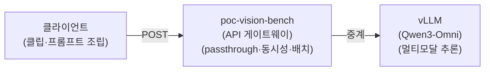

<br />

**검증 환경:**

AWS g7e.4xlarge(VRAM 96G) vLLM 서빙 / Qwen3-Omni-30B-A3B-Instruct(Qwen 멀티 모달 모델)

## 1. 프로젝트 개요

- 영상 분석 파이프라인
  - **클라이언트 →** `poc-vision-bench` **(API 서버) → vLLM(Qwen3-Omni)**

  - **위 플로우가 정상 동작하는지** 검증한다.
    - 분석 품질·파라미터 튜닝·정량 평가는 추후

- **검증 흐름:**



- **본 편에서 확인하는 것 — API 3종:**
  1. **상태 조회** — `/healthz`

  1. **단일 호출** — `/chat`
     1. 텍스트 추론

     1. 영상 추론

     1. 음성만(영상만 제거) 추론 - 영상에서 실제 음성을 분석하는지 검증

  1. **배치 처리** — `/chat/batch`

## 2. 사전 조사

#### **2.1. 분석 모델: Qwen3-Omni-30B-A3B-Instruct**

- 6초 멀티모달 클립의 단일 호출 통합 분석을 위해 `Qwen3-Omni-30B-A3B-Instruct` 채택.
- Image / Video / Audio / Text 4 모달리티를 단일 모델로 처리하며 OpenAI 호환 vLLM 서빙이 가능한 거의 유일한 오픈소스 옵션. **Thinker–Talker MoE** 구조. 추론 코어(Thinker)가 총 30B / 활성 3B, Talker(음성)·오디오/비전 인코더 포함 전체 체크포인트 ≈ **35B** (본 PoC는 텍스트 출력만 사용 → Talker 미사용).

**모델 스펙**

| 항목 | 값 |
| --- | --- |
| 구조 | Thinker–Talker MoE (네이티브 옴니모달 end-to-end) |
| 파라미터 | 추론 코어(Thinker) 총 30B / 활성 3B · Talker·인코더 포함 전체 ≈ 35B |
| 입력 | 텍스트 · 이미지 · 오디오 · 비디오 |
| 출력 | 텍스트(+음성) — 본 PoC는 텍스트만 사용 (Talker 미사용) |
| 컨텍스트 | 네이티브 32,768 토큰 (실서빙은 16,384 운용 → 아래 표) |
| 다국어 지원 | 텍스트 119개 / 음성입력 19개 / 음성출력 10개 → 한국어 모두 지원 |
| 라이선스 | Apache 2.0 (상용 가능) |

**VRAM / 실서빙 설정 (g7e.4xlarge · 1 GPU)**

| **항목** | **값** | **메모** |
| --- | --- | --- |
| GPU | NVIDIA RTX PRO 6000 Blackwell × 1 (96 GB) | 오레곤 us-west-2 |
| BF16 메모리(공식 카드) | 15초 78.85 GB / 30초 88.52 / 60초 107.74 | 6초 클립이라 96 GB에 충분 |
| `--dtype` | bfloat16 | 원본 정밀도(양자화 아님, 66 GiB 풀 체크포인트) |
| `--gpu-memory-utilization` | 0.85 (≈ 81.6 GB 할당) |  |
| `--tensor-parallel-size` | 1 | 단일 GPU |
| `--max-num-seqs` | 8 | 앱 동시성(4)보다 커서 여유 |

**각 항목 설명**

- **GPU - RTX PRO 6000 Blackwell × 1 (96 GB):** Blackwell 세대 서버용 GPU. 30B 모델을 풀 정밀도(BF16)로 KV 캐시·멀티모달 인코더까지 한 장에 올리려면 큰 VRAM 이 필요한데 96 GB 가 이를 감당한다.
- **BF16 메모리(공식 카드):** Qwen 모델 카드가 밝힌 *입력 영상 길이별* VRAM 요구량. 영상이 길수록 비디오 토큰이 늘어 메모리도 증가한다(15초 78.85 GB → 60초 107.74 GB). 본 PoC 는 **6초 클립** 이라 96 GB 에 넓넓히 들어간다(60초였다면 단일 카드 초과).
- `--dtype bfloat16` **:** 양자화 없이 원본 정밀도 그대로 서빙(풀 체크포인트 ≈ 66 GiB). 품질 손실은 없지만 메모리를 많이 쓴다.
- `--gpu-memory-utilization 0.85` **:** vLLM 이 GPU 메모리의 85%(≈ 81.6 GB)를 가중치 + KV 캐시용으로 선점하는 비율. 높이면 동시 처리량(KV 캐시)이 늘지만 OOM 위험이 커지고, 낮추면 안전하나 처리량이 준다.
- `--tensor-parallel-size 1` **:** 모델을 GPU 여러 장에 쪼개지 않고 한 장에 통째로 올린다.
- `--max-num-seqs 8` **:** vLLM 이 동시에 처리하는 요청(시퀀스) 최대 수 = 내부 배치 상한. 게이트웨이(API Server) 동시성(4)보다 커서 vLLM 에 여유가 있다.

> 📍 **이 설정들은 어디에 있나 - 두 곳을 구분**
>
> - 위 `--dtype` ·`--gpu-memory-utilization` ·`--tensor-parallel-size` ·`--max-num-seqs` 는 **vLLM 서버 기동 인자** 다 → 서빙 호스트에서 vLLM 을 띄우는 서비스의 `vllm serve …` 명령에 있음 (우리 게이트웨이 repo 가 아니라 **vLLM 서빙 측** ).
>
> - 우리 게이트웨이(`poc-vision-bench` )의 자체 설정(`VLLM_BASE_URL` ·`VLLM_CONCURRENCY` 등)은 별개로 `.env` **→** `src/config.py` **의** `Settings` 에 있음.

**서빙 컨텍스트 한계**

| **항목** | **값** | **영향** |
| --- | --- | --- |
| 실서빙 `--max-model-len` | **16,384** (네이티브 32,768의 절반) | 컨텍스트 예산 제한 |
| 관측 `prompt_tokens` | ≈ 11,887 (약 73% 소진) | 이미 상당 부분 사용 |
| 리스크 | 고 fps 시 비디오 토큰 급증 → 16k 천장 초과 | 30fps 실험 시 주의 |
| 대응 | `--max-model-len` 상향(KV캐시 VRAM 트레이드오프) 또는 fps 제약 | — |

**각 항목 설명**

- **실서빙** `--max-model-len` **16,384:** 모델이 한 번에 다루는 토큰(입력 + 출력)의 **총 예산** . 네이티브는 32,768 이지만 실서빙은 절반인 16,384 로 운용한다 — KV 캐시 VRAM 을 아끼려는 선택. 이 한도 안에 프롬프트 + 비디오 토큰 + 생성 출력이 **전부** 들어가야 한다.
- **관측** `prompt_tokens` **≈ 11,887 (약 73%):** 실제 한 클립 요청에서 **입력** (프롬프트 + 비디오)이 차지한 토큰. 16,384 의 약 73% 를 입력이 이미 소진 → 출력에 쓸 여유는 약 4,500 토큰 남짓이다.
- **리스크 — 고 fps 시 16k 초과:** 비디오 토큰 수는 **fps 에 비례** 한다. fps 를 올리면(예: 30fps) 비디오 토큰이 급증해 16,384 천장을 넘겨 요청이 실패하거나 잘린다. 본 PoC 가 저 fps(0.5)를 쓰는 이유 중 하나.
- **대응:**
  1. `--max-model-len` 을 32k 로 올려 여유를 늘린다(단 KV 캐시 VRAM 을 더 먹는 **트레이드오프** )

  1. 또는 **fps 를 낮추** 비디오 토큰을 억제한다.

> 📍 **설정 위치 — 서버 vs 클라이언트**
>
> - `--max-model-len` 은 **vLLM 서버 기동 인자** (위 VRAM 설정과 같은 `vllm serve …` ).
>
> - `fps` 는 **클라이언트 요청 본문** 파라미터(`mm_processor_kwargs.fps` )

#### **2.2. 입력 방식:** `from_video` **(mp4 단일 입력) vs** `from_frames_audio` **(분리 입력)**

- 6초 mp4 한 덩어리를 `video_url` (base64 data) 한 컴포넌트로 그대로 넘기는 `from_video` 방식 채택.
- Qwen3-Omni 는 use_audio_in_video 로 영상+오디오 통합 이해를 네이티브 지원하므로, mp4 한 덩어리를 그대로 넘기는 from_video가 모델 권장 입력 방식이자 파이프라인이 가장 단순하다. 분리 입력은 컴포넌트가 4개로 늘고 키프레임 사이 동작 누락·정렬 부담이 있어 보류.

| **비교 항목** | `from_video` **(채택)** | `from_frames_audio` **(보류)** |
| --- | --- | --- |
| **입력 구성** | mp4 한 파일 → `video_url` (data URI) 1 컴포넌트 | 키프레임 JPG N장 + WAV 1 개 → 컴포넌트 4 개 |
| **시간 정렬** | 영상·오디오가 컨테이너 안에서 자동 동기 | 클라이언트 측 별도 정렬 보장 필요 |
| **전처리 산출물 용량** | 6초 mp4 (\~1\~3 MB / 클립) | frames JPG 3 장 + wav (\~수백 KB / 클립) |
| **환각 영향** | 영상·오디오 정렬·맥락 자연 유지 | 키프레임 사이 동작 누락 가능성 |

<br />

## 3. 테스트

### 3.0. 테스트 방법

클라이언트 → API 서버 → vLLM 의 **기본 동작** 을 아래 6단계로 확인한다. (분석 *품질* 평가는 편2·편3.)

1. **샘플 데이터 준비**
   - 테스트 영상 데이터를 준비하고 10분 구간을 6초 클립 100개로 분할한다.

   - ffmpeg 으로 **오디오는 남기고 화면만 검게 가린** 클립을 만들어 둔다(음성-전용 분석 검증용).

1. **분석 서버 실행**
   - 클립을 받아 vLLM 으로 중계할 API 게이트웨이(`poc-vision-bench` )를 띄운다.

1. **단일 추론 호출** (`/chat` )
   1. 텍스트만

   1. 영상 + 프롬프트 

   1. 화면 검정·음성만 영상 + 프롬프트.

1. **배치 추론 호출** (`/chat/batch` )
   - 여러 클립(영상 + 프롬프트)을 한 요청으로 보내 다건 동시 처리를 확인한다.

1. **결과 저장**
   - 호출별 응답과 처리 통계(성공 여부·소요 시간)를 기록한다.

1. **요약·평가**
   - 각 API 가 정상 동작했는지 한눈에 정리한다.

<br />

### 3.1. 테스트 데이터

테스트에 사용된 원본 데이터는 아래와 같다. 가능한 실제 방송 영상과 비슷한 50분\~2시간 사이로 영상.

| **방송** | **재생시간** | **URL** |
| --- | --- | --- |
| KBS 9 뉴스 | 48:30 | [https://www.youtube.com/watch?v=rX1P-jOoNmM](https://www.youtube.com/watch?v=rX1P-jOoNmM) |
| 슈퍼피쉬 1부 | 58:40 | [https://www.youtube.com/watch?v=iNbWqC1iqKw](https://www.youtube.com/watch?v=iNbWqC1iqKw) |
| KBS 겨울 연가 | 1 :04:52 | [https://www.youtube.com/watch?v=irVKEhb9g8M](https://www.youtube.com/watch?v=irVKEhb9g8M) |
| 태조 왕건 | 54:10 | [https://www.youtube.com/watch?v=nmlE2iPWLGM](https://www.youtube.com/watch?v=nmlE2iPWLGM) |
| 출장십오야 X 스타쉽 전국체전 풀버전 | 1 :00:06 | [https://www.youtube.com/watch?v=6wJGpi1nkCg](https://www.youtube.com/watch?v=6wJGpi1nkCg) |
| 2009 프로야구 한국시리즈 7차전 | 1 :55:22 | [https://www.youtube.com/watch?v=fP1QEs1Uj5U](https://www.youtube.com/watch?v=fP1QEs1Uj5U) |
| **2024 LCK SUMMER 결승전 GEN vs HLE** | 2 :11:23 | [https://www.youtube.com/watch?v=_A_I75nJMF8](https://www.youtube.com/watch?v=_A_I75nJMF8) |

**원본 다운로드 (재현 절차)**

위 표의 원본은 아래 절차로 내려받아 `data/raw/{category}/` 에 위치.

- **전제** : `uv` (→ `uvx` )·`ffmpeg` 설치 (ffmpeg는 영상+오디오 스트림 병합에 필요)
1. **원본 다운로드** — 표의 각 URL을 해당 카테고리 폴더로

```bash
cd "$(git rev-parse --show-toplevel)"   # 작업 루트(레포 최상위)로 이동
CAT=&lt;카테고리&gt;; NAME=&lt;원본명&gt;; URL=&lt;테스트 대상 URL&gt;
uvx yt-dlp -f "bv*[ext=mp4]+ba[ext=m4a]/b[ext=mp4]/b" \
--merge-output-format mp4 \
-o "data/raw/$CAT/$NAME.%(ext)s" "$URL"
```

1. **6초 클립 분할** (사전 준비)
- `00:10:00~00:20:00` (원본 600\~1200s) 구간을 6초 100클립으로 분할. 파일명에 원본 절대초 인코딩
- `data/clips/{category}/{원본명}/{seq}_{start}-{end}.mp4`

```bash
cd "$(git rev-parse --show-toplevel)"
CAT=&lt;카테고리&gt;; NAME=&lt;원본명&gt;
SRC="data/raw/$CAT/$NAME.mp4"
OUT="data/clips/$CAT/$NAME"; mkdir -p "$OUT"
for i in $(seq 0 99); do
  start=$((600 + i*6)); end=$((start + 6))  # 절대초 600,606,…,1194
  name=$(printf "%04d_%04d-%04d" $((i+1)) "$start" "$end")  # 0001_0600-0606
  ffmpeg -nostdin -ss "$start" -i "$SRC" -t 6 -c:v libopenh264 -b:v 1500k -c:a aac -movflags +faststart "$OUT/$name.mp4"
done
```

1. **화면 블랙아웃** (음성-전용 검증용)
   - 분할된 첫 클립의 화면만 검게 가리고 오디오는 그대로 둔 클립 1개 생성

   - `data/blackout/{category}/{원본명}/`

```bash
cd "$(git rev-parse --show-toplevel)"
CAT=&lt;카테고리&gt;; NAME=&lt;원본명&gt;
OUT="data/clips/$CAT/$NAME"
FIRST=$(ls "$OUT"/*.mp4 | head -1)          # 분할된 클립 한 개만
BLACK="data/blackout/$CAT/$NAME"; mkdir -p "$BLACK"
ffmpeg -nostdin -i "$FIRST" \
  -vf "drawbox=0:0:iw:ih:color=black:t=fill" \
  -c:v libopenh264 -b:v 300k -c:a copy "$BLACK/$(basename "$FIRST")"
```

> ⚡ **한 번에 실행** 
>
> - 위  작업을 자동화한 스크립트
>
> `./script/prepare_data.sh &lt;카테고리&gt; &lt;파일명&gt; <URL>`
>
> - 원본이 이미 있으면 다운로드를 건너뜀(원본 보호).

<br />

**최종 테스트 클립 데이터**

| **카테고리 키** | **장르** | **클립 수** | **해상도** | **fps** | **평균 크기** | **비고** |
| --- | --- | --- | --- | --- | --- | --- |
| `news` | 뉴스 | 100 | 1920×1080 | 30 | 1.17 MB | 자막·앵커 멘트 비중 높음 |
| `docu` | 다큐 | 100 | 1920×1080 | 30 | 1.62 MB | 내레이션 + 자연·현장음 혼합 |
| `baseball` | 야구 중계 | 100 | 640×360 | 29.97 | 1.13 MB | 캐스터 + 관중 함성 + 전광판 UI |
| `entertain` | 예능 | 100 | 1920×1080 | 29.97 | 1.15 MB | 여러 사람들 대화 + 자막 효과 |
| `drama` | 현대 드라마 | 100 | 720×480 | 29.97 | 1.10 MB | 인물 대사 + BGM |
| `hist_drama` | 사극 | 100 | 1920×1080 | 29.97 | 1.23 MB | 시대 의상·소품 + 문어체 대사 |
| `esports` | e스포츠 | 100 | 1920×1080 | **60** | 1.35 MB | 게임 UI 오버레이 + 캐스터 + 게임음 |
| **합계** | — | **700** | — | — | ≈ 1.25 MB | 원본 영상 7편 (장르당 1편, 10분 윈도우 100 등분) |

> 🔒 **데이터 취급 원칙**
>
> - 영상은 **내부 품질 평가(PoC) 목적에 한해** 사용하며, 외부로 배포·재공개하지 않는다.
>
> - 영상·분석 결과는 코드 저장소에 **포함하지 않는다**
>
> - 가공 사본을 별도 보관하지 않는다.
>
> - 평가 종료 후 로컬 영상·산출물은 보관기간 정책에 따라 **폐기** 한다.

<br />

### 3.2. 분석 서버 (vLLM 앞단 API 게이트웨이)

분석 요청을 받아 vLLM 에 중계하는 경량 서버. 진입점은 `src/app.py` (`PYTHONPATH=src uv run uvicorn app:app --port 8001` ). 대화형 API 문서는 `/docs` (Swagger)·`/redoc` ·`/openapi.json` 로 제공.

#### 3.2.1. 설계

- 서버 `vision-bench` 는 vLLM `/v1/chat/completions` 앞단의 **얇은 게이트웨이** (FastAPI).
- 추론은 vLLM 이 전담하고, 서버는 요청 본문을 변형 없이 패스하며 **3가지만** 부가한다.
  1. Semaphore 동시성 게이트

  1. 배치 NDJSON 스트리밍(실시간 확인)

  1. request_id 로깅(`X-Request-Id` 헤더). 프롬프트 조립·base64 인코딩·`response_format` 스키마 강제·응답 검증은 **모두 클라이언트** 에서 한다.

- 게이트웨이를 passthrough로 두면 실험 변형(프롬프트·스키마·fps·샘플링)을 **클라이언트에서만** 수정.
- 서버는 vLLM 보호(동시성 상한)와 다건 효율(fan-out 스트리밍)만 보장.
- 업스트림 호출은 OpenAI SDK 가 아니라 raw `httpx` 로 그대로 vLLM 추론에 제공.

#### 3.2.2. 동시성 · 백프레셔

- vLLM 업스트림 호출은 `asyncio.Semaphore(VLLM_CONCURRENCY)` (기본 4개) 로 게이트한다. 초과 요청은 **거부하지 않고 대기** .
- `/chat` , `/chat/batch` 가 **같은 Semaphore 공유** → 두 라우트의 처리 중 작업이 상한 이하로 유지.
- Semaphore 는 FastAPI lifespan 에서 1회 생성해 `app.state`  주입(런타임 변경 X).
- `VLLMClient.chat()` 이 Semaphore 를 획득한 **뒤** `time.monotonic()` 으로 측정 → 반환 `elapsed_ms` 는 **큐 대기만 제외한 vLLM 호출 왕복(네트워크 + 추론) 시간** .

**서버 설정 (** `.env` **→** `Settings` **)**

| **키** | **기본** | **역할** |
| --- | --- | --- |
| `VLLM_BASE_URL` | — | vLLM `/v1` 엔드포인트 |
| `VLLM_CONCURRENCY` | 4 | 동시 호출 상한(Semaphore). 권장 1\~8 |
| `MAX_BATCH_ITEMS` | 128 | `/chat/batch` 한 요청의 최대 items |
| `VLLM_TIMEOUT_SECONDS` | 600s | 업스트림 호출 타임아웃 |
| `VLLM_ACQUIRE_TIMEOUT_SECONDS` | 300s | 세마포어 퍼밋 획득 최대 대기(초). 초과 시 그 요청만 실패 처리 → 퍼밋 누수·half-open(끊긴 클라 FIN 미수신)으로 인한 데드락 백스톱 |

#### 3.2.3. 배치 NDJSON 스트리밍

- `/chat/batch` 는 다건을 받아 fan-out(`asyncio.create_task` ) 후 **완료 순서** (`asyncio.wait(..., return_when=FIRST_COMPLETED)` )로 한 줄씩 흘린다(`application/x-ndjson` , chunked). 입력 순서가 아니므로 `id` 로 매칭하며, 한두 건이 실패해도 나머지는 계속 진행한다(각 라인의 `status` 로 판단).
- **백프레셔·데드락 하드닝:** 스트리밍 루프는 0.5초마다 `request.is_disconnected()` 로 클라 생존을 확인해, 클라가 끊기면(FIN 수신) in-flight task 를 전부 cancel 하고 세마포어 퍼밋을 즉시 반납한다. half-open(FIN 미수신)처럼 끊김을 못 잡는 경우는 `client.chat()` 의 **퍼밋 획득 타임아웃** (`VLLM_ACQUIRE_TIMEOUT_SECONDS` , 기본 300s)이 되어 그 요청만 실패 처리한다 → 끊긴 런이 퍼밋을 영구 점유해 게이트웨이가 멈추는 데드락 방지.

요청 본문:

```json
{"items": [
  {"id": "0001_0600-0606", "body": {&lt;vLLM chat.completions body — /chat 와 동일&gt;}},
  {"id": "0002_0606-0612", "body": {<...>}}
]}
```

응답 (라인 1개 = JSON 객체 1개, 줄바꿈 구분):

```json
{"id": "0001_0600-0606", "status": 200, "elapsed_ms": 3104, "body": {&lt;vLLM 응답&gt;}}
{"id": "0002_0606-0612", "status": 500, "elapsed_ms": 0, "error": "&lt;메시지&gt;"}
```

| **필드** | **의미** |
| --- | --- |
| `id` | 클라가 보낸 식별자(보통 clip_id). vLLM 이 발급하는 `body.id` (`chatcmpl-…` ) 와 의미가 다름 |
| `status` | 200=성공 / vLLM 4xx·5xx 그대로 / 500=서버측 예외(네트워크 끊김 등) |
| `elapsed_ms` | Semaphore 획득 후 vLLM 응답 완료까지(큐 대기 제외). 예외 시 0 |
| `body` / `error` | 성공 시 vLLM 응답 본문 / 실패 시 에러 메시지 |

- **제약:** `len(items) ≤ MAX_BATCH_ITEMS` (기본 128). 초과 시 즉시 **413** (NDJSON 시작 X, 단일 JSON 에러). 응답 헤더에 `X-Batch-Total` (받은 items 수) 동봉.

#### 3.2.4. 서버 실행

게이트웨이는 `script/service.sh` 로 관리한다.

```bash
./script/service.sh start      # 백그라운드 기동 (healthz OK 까지 대기)
./script/service.sh status     # PID·healthz·포트 확인
./script/service.sh restart    # stop → start
./script/service.sh stop
```

- 직접 실행: `PYTHONPATH=src uv run uvicorn app:app --host 0.0.0.0 --port 8001`
- vLLM 연결·동시성은 `.env` (→ 3.2.2). 대화형 문서: `/docs` (Swagger)

#### 3.2.5. API 입출력 예시

| **Method** | **Path** | **역할** | **비고** |
| --- | --- | --- | --- |
| GET | `/healthz` | 헬스체크 | lifespan 통과 후 항상 200. 업스트림 도달 여부는 검사 X |
| POST | `/chat` | 단건 passthrough | vLLM body 그대로 → 응답 그대로. 업스트림 도달 불가 시 502 |
| POST | `/chat/batch` | 다건 NDJSON 스트리밍 | 완료 순서로 라인별 흘림 (상세 3.2.3) |

1. `/healthz`

```json
{"ok": true}
```

1. `/chat` (단건)
- 입력: 클라가 조립한 vLLM body (base64 영상 + 프롬프트 + strict schema)

```json
{
  "model": "qwen",
  "messages": [{"role": "user", "content": [
    {"type": "video_url", "video_url": {"url": "data:video/mp4;base64,<...>"}},
    {"type": "text", "text": "&lt;프롬프트&gt;"}
  ]}],
  "temperature": 0.2, "max_tokens": 1024,
  "response_format": {"type": "json_schema", "json_schema": {"name": "clip_analysis", "strict": true, "schema": "&lt;AnalysisResult 4필드&gt;"}},
  "mm_processor_kwargs": {"fps": 2.0},
  "chat_template_kwargs": {"enable_thinking": false}
}
```

- 출력: vLLM 응답 그대로 — `choices[0].message.content` 에 strict JSON 문자열:

```json
{
  "id": "chatcmpl-...",
  "choices": [{"message": {"role": "assistant", "content": "&lt;아래 JSON&gt;"}, "finish_reason": "stop"}],
  "usage": {"prompt_tokens": 11887, "completion_tokens": 190, "total_tokens": 12077}
}
```

> 실행: `./script/curl_examples.sh chat`

1. `/chat/batch` (다건) — 입력: `{items:[{id, body}, …]}` (각 body = ②와 동일)

```json
{"items": [
  {"id": "0001_0600-0606", "body": {"&lt;②와 동일&gt;"}},
  {"id": "0002_0606-0612", "body": {"..."}}
]}
```

출력: `application/x-ndjson` — 완료 순서로 한 줄씩 (필드 상세 3.2.3):

```javascript
{"id":"0001_0600-0606","status":200,"elapsed_ms":3104,"body":{&lt;vLLM 응답&gt;}}
{"id":"0002_0606-0612","status":500,"elapsed_ms":0,"error":"&lt;메시지&gt;"}
```

> 실행: `./script/curl_examples.sh batch`

### 3.3. 테스트 실행 및 결과

클라이언트 → API 서버 → vLLM 파이프라인을 §3.0 흐름대로 실제 호출해 확인한다. (재현: `experiments/01_pipeline/smoke.py` )

#### 3.3.1. 상태 조회 (`GET /healthz` )

게이트웨이 생존 확인. lifespan 통과 후 항상 200 (업스트림 vLLM 도달 여부는 검사하지 않음).

```javascript
$ curl -i http://localhost:8001/healthz
HTTP/1.1 200 OK
content-type: application/json
x-request-id: 6da1b40a

{"ok":true}
```

→ **PASS** — 서버 기동·라우팅 정상, 모든 응답에 `X-Request-Id` 부여 확인.

#### 3.3.2. 단일 추론 (`POST /chat` )

**ⓐ 텍스트만**

*(결과 기입 예정)*

**ⓑ 영상 + 프롬프트**

*(결과 기입 예정)*

**ⓒ 화면 검정 · 음성만**

*(결과 기입 예정)*

#### 3.3.3. 배치 추론 (`POST /chat/batch` )

*(결과 기입 예정)*

#### 3.3.4. 요약

*(API별 PASS·소요시간 표 기입 예정)*

---

## 4. 참조 문서

**모델 — Qwen3-Omni**

- [Qwen3-Omni-30B-A3B-Instruct — Hugging Face 모델 카드](https://huggingface.co/Qwen/Qwen3-Omni-30B-A3B-Instruct) — 모달리티·컨텍스트·BF16 VRAM 표·라이선스·한국어 지원
- [Qwen3-Omni Technical Report (arXiv:2509.17765)](https://arxiv.org/abs/2509.17765) — Thinker–Talker MoE 구조, 오디오·AV 36개 중 32개 오픈소스 SOTA
- [QwenLM/Qwen3-Omni — GitHub](https://github.com/QwenLM/Qwen3-Omni) — 사용법, `use_audio_in_video` 영상·오디오 통합

**하드웨어 — AWS g7e**

- [Amazon EC2 G7e 인스턴스 (제품 페이지)](https://aws.amazon.com/ec2/instance-types/g7e/) — RTX PRO 6000 Blackwell, GPU당 96GB
- [G7e 출시 발표 (AWS News Blog)](https://aws.amazon.com/blogs/aws/announcing-amazon-ec2-g7e-instances-accelerated-by-nvidia-rtx-pro-6000-blackwell-server-edition-gpus/) — 2026-01 GA
- [g7e.4xlarge 스펙 — Vantage](https://instances.vantage.sh/aws/ec2/g7e.4xlarge) — 1 GPU / 96 GiB / 16 vCPU / 128 GiB

**서빙 — vLLM**

- [Qwen3-Omni vLLM 서빙 가이드](https://docs.vllm.ai/projects/vllm-omni/en/latest/user_guide/examples/online_serving/qwen3_omni/) — `vllm serve` 옵션 (`--max-model-len` 등)

