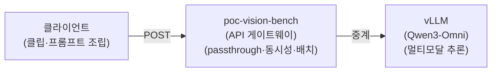

**검증 환경:**

AWS g7e.4xlarge(VRAM 96G) vLLM 서빙 / Qwen3-Omni-30B-A3B-Instruct(Qwen 멀티 모달 모델)

## 1. 프로젝트 개요

- 영상 분석 파이프라인
  - **클라이언트 →** `poc-vision-bench` **(API 서버) → vLLM(Qwen3-Omni)**

  - **위 플로우가 정상 동작하는지** 검증한다.
    - 분석 품질·파라미터 튜닝·정량 평가는 추후

- **검증 흐름:**



- **본 편에서 확인하는 것 — API 3종:**
  1. **상태 조회** — `/healthz`

  1. **단일 호출** — `/chat`
     1. 텍스트 추론

     1. 영상 추론

     1. 음성만(영상만 제거) 추론 - 영상에서 실제 음성을 분석하는지 검증

  1. **배치 처리** — `/chat/batch`

## 2. 사전 조사

#### **2.1. 분석 모델: Qwen3-Omni-30B-A3B-Instruct**

- 6초 멀티모달 클립의 단일 호출 통합 분석을 위해 `Qwen3-Omni-30B-A3B-Instruct` 채택.

- Image / Video / Audio / Text 4 모달리티를 단일 모델로 처리하며 OpenAI 호환 vLLM 서빙이 가능한 거의 유일한 오픈소스 옵션. **Thinker–Talker MoE** 구조. 추론 코어(Thinker)가 총 30B / 활성 3B, Talker(음성)·오디오/비전 인코더 포함 전체 체크포인트 ≈ **35B** (본 PoC는 텍스트 출력만 사용 → Talker 미사용).

**모델 스펙**

| 항목 | 값 |
| --- | --- |
| 구조 | Thinker–Talker MoE (네이티브 옴니모달 end-to-end) |
| 파라미터 | 추론 코어(Thinker) 총 30B / 활성 3B · Talker·인코더 포함 전체 ≈ 35B |
| 입력 | 텍스트 · 이미지 · 오디오 · 비디오 |
| 출력 | 텍스트(+음성) — 본 PoC는 텍스트만 사용 (Talker 미사용) |
| 컨텍스트 | 네이티브 32,768 토큰 (실서빙은 16,384 운용 → 아래 표) |
| 다국어 지원 | 텍스트 119개 / 음성입력 19개 / 음성출력 10개 → 한국어 모두 지원 |
| 라이선스 | Apache 2.0 (상용 가능) |

**VRAM / 실서빙 설정 (g7e.4xlarge · 1 GPU)**

| **항목** | **값** | **메모** |
| --- | --- | --- |
| GPU | NVIDIA RTX PRO 6000 Blackwell × 1 (96 GB) | 오레곤 us-west-2 |
| BF16 메모리(공식 카드) | 15초 78.85 GB / 30초 88.52 / 60초 107.74 | 6초 클립이라 96 GB에 충분 |
| `--dtype` | bfloat16 | 원본 정밀도(양자화 아님, 66 GiB 풀 체크포인트) |
| `--gpu-memory-utilization` | 0.85 (≈ 81.6 GB 할당) |  |
| `--tensor-parallel-size` | 1 | 단일 GPU |
| `--max-num-seqs` | 8 | 앱 동시성(4)보다 커서 여유 |

**각 항목 설명**

- **GPU - RTX PRO 6000 Blackwell × 1 (96 GB):** Blackwell 세대 서버용 GPU. 30B 모델을 풀 정밀도(BF16)로 KV 캐시·멀티모달 인코더까지 한 장에 올리려면 큰 VRAM 이 필요한데 96 GB 가 이를 감당한다.

- **BF16 메모리(공식 카드):** Qwen 모델 카드가 밝힌 *입력 영상 길이별* VRAM 요구량. 영상이 길수록 비디오 토큰이 늘어 메모리도 증가한다(15초 78.85 GB → 60초 107.74 GB). 본 PoC 는 **6초 클립** 이라 96 GB 에 넓넓히 들어간다(60초였다면 단일 카드 초과).

- `--dtype bfloat16` **:** 양자화 없이 원본 정밀도 그대로 서빙(풀 체크포인트 ≈ 66 GiB). 품질 손실은 없지만 메모리를 많이 쓴다.

- `--gpu-memory-utilization 0.85` **:** vLLM 이 GPU 메모리의 85%(≈ 81.6 GB)를 가중치 + KV 캐시용으로 선점하는 비율. 높이면 동시 처리량(KV 캐시)이 늘지만 OOM 위험이 커지고, 낮추면 안전하나 처리량이 준다.

- `--tensor-parallel-size 1` **:** 모델을 GPU 여러 장에 쪼개지 않고 한 장에 통째로 올린다.

- `--max-num-seqs 8` **:** vLLM 이 동시에 처리하는 요청(시퀀스) 최대 수 = 내부 배치 상한. 게이트웨이(API Server) 동시성(4)보다 커서 vLLM 에 여유가 있다.

> 📍 **이 설정들은 어디에 있나 - 두 곳을 구분**
>
> - 위 `--dtype` ·`--gpu-memory-utilization` ·`--tensor-parallel-size` ·`--max-num-seqs` 는 **vLLM 서버 기동 인자** 다 → 서빙 호스트에서 vLLM 을 띄우는 서비스의 `vllm serve …` 명령에 있음 (우리 게이트웨이 repo 가 아니라 **vLLM 서빙 측** ).
>
> - 우리 게이트웨이(`poc-vision-bench` )의 자체 설정(`VLLM_BASE_URL` ·`VLLM_CONCURRENCY` 등)은 별개로 `.env` **→** `src/config.py` **의** `Settings` 에 있음.

**서빙 컨텍스트 한계**

| **항목** | **값** | **영향** |
| --- | --- | --- |
| 실서빙 `--max-model-len` | **16,384** (네이티브 32,768의 절반) | 컨텍스트 예산 제한 |
| 관측 `prompt_tokens` | ≈ 11,887 (약 73% 소진) | 이미 상당 부분 사용 |
| 리스크 | 고 fps 시 비디오 토큰 급증 → 16k 천장 초과 | 30fps 실험 시 주의 |
| 대응 | `--max-model-len` 상향(KV캐시 VRAM 트레이드오프) 또는 fps 제약 | — |

**각 항목 설명**

- **실서빙** `--max-model-len` **16,384:** 모델이 한 번에 다루는 토큰(입력 + 출력)의 **총 예산** . 네이티브는 32,768 이지만 실서빙은 절반인 16,384 로 운용한다 — KV 캐시 VRAM 을 아끼려는 선택. 이 한도 안에 프롬프트 + 비디오 토큰 + 생성 출력이 **전부** 들어가야 한다.

- **관측** `prompt_tokens` **≈ 11,887 (약 73%):** 실제 한 클립 요청에서 **입력** (프롬프트 + 비디오)이 차지한 토큰. 16,384 의 약 73% 를 입력이 이미 소진 → 출력에 쓸 여유는 약 4,500 토큰 남짓이다.

- **리스크 — 고 fps 시 16k 초과:** 비디오 토큰 수는 **fps 에 비례** 한다. fps 를 올리면(예: 30fps) 비디오 토큰이 급증해 16,384 천장을 넘겨 요청이 실패하거나 잘린다. 본 PoC 가 저 fps(0.5)를 쓰는 이유 중 하나.

- **대응:**
  1. `--max-model-len` 을 32k 로 올려 여유를 늘린다(단 KV 캐시 VRAM 을 더 먹는 **트레이드오프** )

  1. 또는 **fps 를 낮추** 비디오 토큰을 억제한다.

> 📍 **설정 위치 — 서버 vs 클라이언트**
>
> - `--max-model-len` 은 **vLLM 서버 기동 인자** (위 VRAM 설정과 같은 `vllm serve …` ).
>
> - `fps` 는 **클라이언트 요청 본문** 파라미터(`mm_processor_kwargs.fps` )

#### **2.2. 입력 방식:** `from_video` **(mp4 단일 입력) vs** `from_frames_audio` **(분리 입력)**

- 6초 mp4 한 덩어리를 `video_url` (base64 data) 한 컴포넌트로 그대로 넘기는 `from_video` 방식 채택.

- Qwen3-Omni 는 use_audio_in_video 로 영상+오디오 통합 이해를 네이티브 지원하므로, mp4 한 덩어리를 그대로 넘기는 from_video가 모델 권장 입력 방식이자 파이프라인이 가장 단순하다. 분리 입력은 컴포넌트가 4개로 늘고 키프레임 사이 동작 누락·정렬 부담이 있어 보류.

| **비교 항목** | `from_video` **(채택)** | `from_frames_audio` **(보류)** |
| --- | --- | --- |
| **입력 구성** | mp4 한 파일 → `video_url` (data URI) 1 컴포넌트 | 키프레임 JPG N장 + WAV 1 개 → 컴포넌트 4 개 |
| **시간 정렬** | 영상·오디오가 컨테이너 안에서 자동 동기 | 클라이언트 측 별도 정렬 보장 필요 |
| **전처리 산출물 용량** | 6초 mp4 (\~1\~3 MB / 클립) | frames JPG 3 장 + wav (\~수백 KB / 클립) |
| **환각 영향** | 영상·오디오 정렬·맥락 자연 유지 | 키프레임 사이 동작 누락 가능성 |

<br />

## 3. 테스트

### 3.0. 테스트 방법

클라이언트 → API 서버 → vLLM 의 **기본 동작** 을 아래 6단계로 확인한다. (분석 *품질* 평가는 편2·편3.)

1. **샘플 데이터 준비**
   - 테스트 영상 데이터를 준비하고 10분 구간을 6초 클립 100개로 분할한다.

   - ffmpeg 으로 **오디오는 남기고 화면만 검게 가린** 클립을 만들어 둔다(음성-전용 분석 검증용).

1. **분석 서버 실행**
   - 클립을 받아 vLLM 으로 중계할 API 게이트웨이(`poc-vision-bench` )를 띄운다.

1. **단일 추론 호출** (`/chat` )
   1. 텍스트만

   1. 영상 + 프롬프트 

   1. 화면 검정·음성만 영상 + 프롬프트.

1. **배치 추론 호출** (`/chat/batch` )
   - 여러 클립(영상 + 프롬프트)을 한 요청으로 보내 다건 동시 처리를 확인한다.

1. **결과 저장**
   - 호출별 응답과 처리 통계(성공 여부·소요 시간)를 기록한다.

1. **요약·평가**
   - 각 API 가 정상 동작했는지 한눈에 정리한다.

<br />

### 3.1. 테스트 데이터

테스트에 사용된 원본 데이터는 아래와 같다. 가능한 실제 방송 영상과 비슷한 50분\~2시간 사이로 영상.

| **방송** | **재생시간** | **URL** |
| --- | --- | --- |
| KBS 9 뉴스 | 48:30 | [https://www.youtube.com/watch?v=rX1P-jOoNmM](https://www.youtube.com/watch?v=rX1P-jOoNmM) |
| 슈퍼피쉬 1부 | 58:40 | [https://www.youtube.com/watch?v=iNbWqC1iqKw](https://www.youtube.com/watch?v=iNbWqC1iqKw) |
| KBS 겨울 연가 | 1 :04:52 | [https://www.youtube.com/watch?v=irVKEhb9g8M](https://www.youtube.com/watch?v=irVKEhb9g8M) |
| 태조 왕건 | 54:10 | [https://www.youtube.com/watch?v=nmlE2iPWLGM](https://www.youtube.com/watch?v=nmlE2iPWLGM) |
| 출장십오야 X 스타쉽 전국체전 풀버전 | 1 :00:06 | [https://www.youtube.com/watch?v=6wJGpi1nkCg](https://www.youtube.com/watch?v=6wJGpi1nkCg) |
| 2009 프로야구 한국시리즈 7차전 | 1 :55:22 | [https://www.youtube.com/watch?v=fP1QEs1Uj5U](https://www.youtube.com/watch?v=fP1QEs1Uj5U) |
| **2024 LCK SUMMER 결승전 GEN vs HLE** | 2 :11:23 | [https://www.youtube.com/watch?v=_A_I75nJMF8](https://www.youtube.com/watch?v=_A_I75nJMF8) |

**원본 다운로드 (재현 절차)**

위 표의 원본은 아래 절차로 내려받아 `data/raw/{category}/` 에 위치.

- **전제** : `uv` (→ `uvx` )·`ffmpeg` 설치 (ffmpeg는 영상+오디오 스트림 병합에 필요)

1. **원본 다운로드** — 표의 각 URL을 해당 카테고리 폴더로

```bash
cd "$(git rev-parse --show-toplevel)"   # 작업 루트(레포 최상위)로 이동 — 이후 상대경로 기준
CAT=&lt;카테고리&gt;; NAME=&lt;원본명&gt;; URL=&lt;테스트 대상 URL&gt;
uvx yt-dlp -f "bv*[ext=mp4]+ba[ext=m4a]/b[ext=mp4]/b" \
--merge-output-format mp4 \
-o "data/raw/$CAT/$NAME.%(ext)s" "$URL"
```

- `-f "bv*[ext=mp4]+ba[ext=m4a]/…"` : **H.264+AAC mp4 우선** (vLLM/ffmpeg 디코딩 호환). 해당 포맷 없으면 최고품질로 폴백(`/b` )

- `--merge-output-format mp4` : mp4 컨테이너로 병합

<br />

1. **6초 클립 분할** (사전 준비) — `00:10:00~00:20:00` (원본 절대초 600\~1200s) 구간을 6초 100클립으로 분할. 파일명에 원본 절대초 인코딩 → `data/clips/{category}/{원본명}/{seq}_{start}-{end}.mp4`

```bash
cd "$(git rev-parse --show-toplevel)"   # 작업 루트(레포 최상위)로 이동
CAT=&lt;카테고리&gt;; NAME=&lt;원본명&gt;
SRC="data/raw/$CAT/$NAME.mp4"
OUT="data/clips/$CAT/$NAME"; mkdir -p "$OUT"
for i in $(seq 0 99); do
  start=$((600 + i*6)); end=$((start + 6))  # 절대초 600,606,…,1194
  name=$(printf "%04d_%04d-%04d" $((i+1)) "$start" "$end")  # 0001_0600-0606
  ffmpeg -nostdin -ss "$start" -i "$SRC" -t 6 -c:v libopenh264 -b:v 1500k -c:a aac -movflags +faststart "$OUT/$name.mp4"
done
```

- **인코더** : `libopenh264` . `libx264` 빌드면 `-c:v libx264 -crf 20` 으로 동일 결과

- **재인코딩 분할** — 클립마다 독립 키프레임 → 경계 정확·단독 디코딩 가능 (원본은 그대로, 클립만 생성)

- **오디오 포함** (`-c:a aac` ) — vLLM이 mp4 안의 오디오를 함께 디코딩해야 하므로 필수

<br />

1. **화면 블랙아웃** (음성-전용 검증용) — 분할된 첫 클립의 화면만 검게 가리고 오디오는 그대로 둔 클립 1개 생성 → `data/blackout/{category}/{원본명}/`

```bash
FIRST=$(ls "$OUT"/*.mp4 | head -1)          # 분할된 첫 클립
BLACK="data/blackout/$CAT/$NAME"; mkdir -p "$BLACK"
ffmpeg -nostdin -i "$FIRST" \
  -vf "drawbox=0:0:iw:ih:color=black:t=fill" \
  -c:v libopenh264 -b:v 300k -c:a copy "$BLACK/$(basename "$FIRST")"
```

- `drawbox …:t=fill` : 전 프레임을 검게 덮어 시각 정보 0 · `-c:a copy` : 오디오는 재인코딩 없이 그대로

- 화면 없이도 모델이 소리를 묘사하면 = 영상이 아니라 **오디오를 실제로 처리** 한다는 증거 (→ §3.3 ⓒ 음성-전용 테스트)

> ⚡ **한 번에 실행** 
>
> - 위 ①\~③ 을 자동화한 스크립트
>
> `./script/prepare_data.sh &lt;카테고리&gt; &lt;파일명&gt; <URL>`
>
> - 원본이 이미 있으면 다운로드를 건너뛴다(원본 보호).
>
> - 분할 윈도우는 `WIN_START` ·`CLIP_LEN` ·`CLIP_COUNT` 환경변수로 override.

<br />

**최종 테스트 클립 데이터**

| **카테고리 키** | **장르** | **클립 수** | **해상도** | **fps** | **평균 크기** | **비고** |
| --- | --- | --- | --- | --- | --- | --- |
| `news` | 뉴스 | 100 | 1280×720 | 30 | 1.12 MB | 자막·앵커 멘트 비중 높음 |
| `docu` | 다큐 | 100 | 1280×720 | 30 | 1.18 MB | 내레이션 + 자연·현장음 혼합 |
| `baseball` | 야구 중계 | 100 | 640×360 | 29.97 | 1.13 MB | 캐스터 + 관중 함성 + 전광판 UI |
| `entertain` | 예능 | 100 | 1280×720 | 29.97 | 1.14 MB | 다인 대화 + 자막 효과 |
| `drama` | 현대 드라마 | 100 | 720×480 | 29.97 | 1.08 MB | 인물 대사 + BGM |
| `hist_drama` | 사극 | 100 | 1280×720 | 29.97 | 1.16 MB | 시대 의상·소품 + 문어체 대사 |
| `esports` | e스포츠 | 100 | 1280×720 | **60** | 1.16 MB | 게임 UI 오버레이 + 캐스터 + 게임음 |
| **합계** | — | **700** | — | — | ≈ 1.14 MB | 원본 영상 7편 (장르당 1편, 10분 윈도우 100 등분) |

> 🔒 **데이터 취급 원칙**
>
> - 영상은 **내부 품질 평가(PoC) 목적에 한해** 사용하며, 외부로 배포·재공개하지 않는다.
>
> - 영상(data/)·분석 결과(predictions/)는 코드 저장소에 **포함하지 않는다 (gitignore, 외부 공개 커밋 금지)** .
>
> - 추론 입력은 클립을 **base64로 메모리에서 인코딩해 1회 전송** 하며, 가공 사본을 별도 보관하지 않는다.
>
> - 평가 종료 후 로컬 영상·산출물은 보관기간 정책에 따라 **폐기** 한다.

<br />

### 3.2. 분석 서버 (vLLM 앞단 API 게이트웨이)

분석 요청을 받아 vLLM 에 중계하는 경량 서버. 진입점은 `src/app.py` (`PYTHONPATH=src uv run uvicorn app:app --port 8001` ). 대화형 API 문서는 `/docs` (Swagger)·`/redoc` ·`/openapi.json` 로 제공.

#### 3.2.1. 설계

- **결론:** 서버 `vision-bench` 는 vLLM `/v1/chat/completions` 앞단의 **얇은 게이트웨이** (FastAPI). 추론은 vLLM 이 전담하고, 서버는 요청 본문을 변형 없이 패스하며 **3가지만** 부가한다.
  1. Semaphore 동시성 게이트, 

  1. 배치 NDJSON 스트리밍, 

  1. request_id 로깅(`X-Request-Id` 헤더). 프롬프트 조립·base64 인코딩·`response_format` 스키마 강제·응답 검증은 **모두 클라이언트 책임** .

- **이유:** 게이트웨이를 passthrough로 두면 실험 변형(프롬프트·스키마·fps·샘플링)을 **클라이언트에서만** 갈아끼우며 A/B 할 수 있고, 서버는 한 번 띄우면 안 건드린다. 서버는 vLLM 보호(동시성 상한)와 다건 효율(fan-out 스트리밍)만 책임진다. 업스트림 호출은 OpenAI SDK 가 아니라 raw `httpx` 로 — SDK 가 본문을 미묘히 변형해 "그대로 패스"가 깨지는 것을 피한다.

| **Method** | **Path** | **역할** | **비고** |
| --- | --- | --- | --- |
| GET | `/healthz` | 헬스체크 | lifespan 통과 후 항상 200. **업스트림 vLLM 도달 여부는 검사 X** |
| POST | `/chat` | 단건 passthrough | vLLM body 그대로 → vLLM 응답 그대로(envelope 없음). 업스트림 도달 불가 시 **502** |
| POST | `/chat/batch` | 다건 NDJSON 스트리밍 | `{items:[{id, body}]}` → **완료 순서** 로 라인별 흘림 |

#### 3.2.2. 동시성 · 백프레셔

- vLLM 업스트림 호출은 `asyncio.Semaphore(VLLM_CONCURRENCY)` (기본 4개) 로 게이트한다. 초과 요청은 **거부하지 않고 대기** . `/chat` 과 `/chat/batch` 가 **같은 Semaphore 를 공유** → 두 라우트의 처리 중 작업 합산이 상한 이하로 유지된다.

- Semaphore 는 FastAPI lifespan 에서 1회 생성해 `app.state` 로 주입(런타임 변경 X).

- `VLLMClient.chat()` 이 Semaphore 를 획득한 **뒤** `time.monotonic()` 으로 측정 → 반환 `elapsed_ms` 는 **큐 대기만 제외한 vLLM 호출 왕복(네트워크 + 추론) 시간** (GPU 추론만은 아님). 처리량 지표의 분모가 큐 대기에 오염되지 않는다.

**서버 설정 (** `.env` **→** `Settings` **)**

| **키** | **기본** | **역할** |
| --- | --- | --- |
| `VLLM_BASE_URL` | — | vLLM `/v1` 엔드포인트 |
| `VLLM_CONCURRENCY` | 4 | 동시 호출 상한(Semaphore). 권장 1\~8 |
| `MAX_BATCH_ITEMS` | 128 | `/chat/batch` 한 요청의 최대 items |
| `VLLM_TIMEOUT_SECONDS` | 600 | 업스트림 호출 타임아웃 |
| `VLLM_ACQUIRE_TIMEOUT_SECONDS` | 300 | 세마포어 퍼밋 획득 최대 대기(초). 초과 시 그 요청만 실패 처리 → 퍼밋 누수·half-open(끊긴 클라 FIN 미수신)으로 인한 데드락 백스톱 |

#### 3.2.3. 배치 NDJSON 스트리밍

- `/chat/batch` 는 다건을 받아 fan-out(`asyncio.create_task` ) 후 **완료 순서** (`asyncio.wait(..., return_when=FIRST_COMPLETED)` )로 한 줄씩 흘린다(`application/x-ndjson` , chunked). 입력 순서가 아니므로 `id` 로 매칭하며, 한두 건이 실패해도 나머지는 계속 진행한다(각 라인의 `status` 로 판단).

- **백프레셔·데드락 하드닝:** 스트리밍 루프는 0.5초마다 `request.is_disconnected()` 로 클라 생존을 확인해, 클라가 끊기면(FIN 수신) in-flight task 를 전부 cancel 하고 세마포어 퍼밋을 즉시 반납한다. half-open(FIN 미수신)처럼 끊김을 못 잡는 경우는 `client.chat()` 의 **퍼밋 획득 타임아웃** (`VLLM_ACQUIRE_TIMEOUT_SECONDS` , 기본 300s)이 되어 그 요청만 실패 처리한다 → 끊긴 런이 퍼밋을 영구 점유해 게이트웨이가 멈추는 데드락 방지.

요청 본문:

```json
{"items": [
  {"id": "0001_0600-0606", "body": {&lt;vLLM chat.completions body — /chat 와 동일&gt;}},
  {"id": "0002_0606-0612", "body": {<...>}}
]}
```

응답 (라인 1개 = JSON 객체 1개, 줄바꿈 구분):

```json
{"id": "0001_0600-0606", "status": 200, "elapsed_ms": 3104, "body": {&lt;vLLM 응답&gt;}}
{"id": "0002_0606-0612", "status": 500, "elapsed_ms": 0, "error": "&lt;메시지&gt;"}
```

| **필드** | **의미** |
| --- | --- |
| `id` | 클라가 보낸 식별자(보통 clip_id). vLLM 이 발급하는 `body.id` (`chatcmpl-…` ) 와 의미가 다름 |
| `status` | 200=성공 / vLLM 4xx·5xx 그대로 / 500=서버측 예외(네트워크 끊김 등) |
| `elapsed_ms` | Semaphore 획득 후 vLLM 응답 완료까지(큐 대기 제외). 예외 시 0 |
| `body` / `error` | 성공 시 vLLM 응답 본문 / 실패 시 에러 메시지 |

- **제약:** `len(items) ≤ MAX_BATCH_ITEMS` (기본 128). 초과 시 즉시 **413** (NDJSON 시작 X, 단일 JSON 에러). 응답 헤더에 `X-Batch-Total` (받은 items 수) 동봉.

#### 3.2.4. 클라이언트 책임 + 호출 파라미터

API 서버는 passthrough이므로 요청 본문 전체(messages·schema·추론 파라미터)를 **클라이언트가 조립** 한다.

| **항목** | **내용** |
| --- | --- |
| 비디오 인코딩 | mp4 → base64 data URI → `messages[0].content[0].video_url.url` |
| 프롬프트 조립 | 텍스트 프롬프트(한국어/영어, 스크립트 사용 여부, A/B variant 등) |
| 출력 스키마 강제 | `response_format.json_schema` 에 `AnalysisResult.model_json_schema()` (strict) |
| vLLM 확장키 | `mm_processor_kwargs` (fps, use_audio_in_video), `chat_template_kwargs` (`enable_thinking: false` — 사고 토큰 비활성) — 본문 **top-level** |
| 응답 검증 | `AnalysisResult.model_validate(...)` 로 4필드(`summary/objects/actions/audio` ) 강제 |

**호출 파라미터(프레임워크)** — 추론 매개변수는 서버 Settings 가 아니라 클라이언트가 요청 본문에 직접 명시한다.

| **파라미터** | **역할** | **값 범위** |
| --- | --- | --- |
| `temperature` | 샘플링 온도, 낮을수록 결정론적, 높을수록 다양·창의 | `[0, 2]` · 0=greedy(argmax) |
| `top_p` | nucleus 컷오프, 누적확률 상위 토큰만 후보 | `[0, 1]` · `temp>0` 일 때만 (temp=0 이면 inert) |
| `top_k` | 후보를 확률 상위 k개로 제한 | `-1` =비활성 / `≥1` (1=argmax) · `temp>0` 일 때만 |
| `max_tokens` | completion 토큰 상한 (출력 길이 측) | `>0` · 남은 컨텍스트 이내 |
| `frequency_penalty` | 가산형 반복 억제, 생성 텍스트 내 등장 횟수에 비례 | `[-2, 2]` · 양수=억제 / 0=비활성 |
| `repetition_penalty` | 곱셈형 반복 억제 (vLLM/HF 확장) | `>0` · `&lt;1` =장려 / `1` =비활성 / `&gt;1` =억제 (`0` 은 vLLM 400) |
| `seed` | 재현성, 고정 시 동일 입력→동일 출력 | 정수 · `&lt;0` =비활성(매번 무작위) |
| `mm_processor_kwargs.fps` | 영상 프레임 샘플링 레이트 (↑ 토큰·디테일↑) | `&gt;0` (예 0.5\~2.0) · 고 fps 는 16k 컨텍스트 초과 주의 |
| `mm_processor_kwargs.use_audio_in_video` | mp4 내 오디오 동시 디코딩 on/off | `true` / `false` (bool) |
| `chat_template_kwargs.enable_thinking` | 사고(thinking) 토큰 생성 on/off — 본 PoC 는 off | `true` / `false` (bool, 기본 false) |

> 📌 `frequency_penalty` **vs** `repetition_penalty` - 둘 다 반복을 억제하지만 방식이 다르다.
>
> - **frequency** (가산·빼기)
>   - 이미 **많이** 나온 토큰일수록 **더** 깎음(횟수 비례·누적) → 폭주 루프(`공 공 공…` ) 제동에 강함. **출력 토큰만** 카운트. 비활성 `0` , 범위 `[-2, 2]` .
>
> - **repetition** (곱셈·나눔기)
>   - 한 번이라도 나오면 **일정 비율** 로 깎음(등장 여부만, 횟수 무관). vLLM 은 **프롬프트 + 출력** 모두 보므로 프롬프트 어휘까지 억제될 수 있음(recall 손실 소지↑). 비활성 `1.0` , 범위 `>0` (`>1` =억제, `0` 은 vLLM 400).
>
> - 예: '공'이 3번 나온 뒤 다음 logit 5.0 → frequency 0.5 = 5.0 − 0.5×3 = **3.5** , repetition 1.2 = 5.0 ÷ 1.2 ≈ **4.17** .
>
> - ⚠️ 둘 다 켜면 **2중 억제(과함)**

- **⚠️ 확정값·근거·운영 이슈는 3.3 에서:** 위 파라미터의 최종 채택값과 선택 근거, 그리고 운영 중 발견한 이슈(출력 degeneration·재시도 전략·vLLM 멀티모달 캐시)는 **결과 섹션(3.3)** 에서 수치와 함께 다룬다. 본 절은 "어떤 knob 을 누가 정하는가"의 프레임워크만 기술한다.

### 3.3. 추론 파라미터 튜닝 (1단계: 형태·반복 스크리닝)

- **위치:** 추론 파라미터를 **먼저** 잡고(본 절) → 그 설정으로 베이스라인을 돌려 Gemini 정답지와 비교(**3.4** , 최적값 확정)하는 순서. 실험 디렉토리 `experiments/01_param_sweep` .

- **동기:** 간헐적으로 출력에 이상 패턴 — 같은 말 **반복** · 문장 **파편화** · **이종문자 폭주가** 나타난다. 이를 추론 파라미터로 통제할 수 있는지, 한 번에 하나씩(OFAT, one-factor-at-a-time) 크게 흔들어 각 knob 이 출력을 어떻게 바꾸는지 규명한다.

#### 3.3.1. 방법론 — 1단계에서 무엇을 정하나

- **결론:** 7장르 × 등간격 10클립 = **고정 70 샘플** 에, 파라미터를 하나씩 크게 바꿔(OFAT) **18개 설정** 을 돌리고 출력의 **형태·반복** 을 집계한다. 모든 설정이 동일 70샘플·동일 프롬프트를 쓴다.

- **핵심 분리 — 정답지 없이 잴 수 있는 것만 1단계에서 다룬다:**

| **구분** | **판정 대상** | **정답지** | **어디서** |
| --- | --- | --- | --- |
| **순응 (adherence)** | 한국어인가 · JSON 형식 맞나 · 항목이 짧은가 · 반복 없나 (전부 *프롬프트가 명시한 규칙* ) | 불필요 | **본 절 (3.3)** |
| **품질 (quality)** | 완전성(빠뜨린 것 없나) · 정확성(환각 없나) | **필요** | **3.4 (Gemini 목적함수)** |

- **이유:** 순응은 프롬프트가 명시한 규칙이라 출력만 보고 판정할 수 있다. 품질은 "정답"이 있어야 채점 가능하므로 Gemini 정답지가 필요하다(→ 2.4, 3.4). 순응은 필요조건이지 충분조건이 아니라 경계가 깔끔히 나뉜다.

- **degeneration 빈도는 참고용:** 출력 붕괴는 희귀사건이라 n=70 단일패스로는 *빈도* 신뢰도가 낮다(+ 배치 동시성 jitter 가 파라미터 효과에 섞임). 따라서 모든 출력에 존재하는 **형태·반복** 만 본 단계의 결론으로 삼고, 빈도의 정밀 측정은 별도 트랙으로 둔다.

**변동 / 고정 인자**

| **구분** | **항목** |
| --- | --- |
| 변동 (OFAT) | temperature · top_k · top_p · frequency_penalty · repetition_penalty · fps |
| 고정 | max_tokens=512 · use_audio_in_video=on · enable_thinking=false · 동일 70샘플 · 동일 프롬프트 |

- OFAT(One-Factor-At-A-Time) : 여러 변수 중 단 하나만 바꾸고 나머지는 전부 고정한 채로 그 변수의
영향을 관찰하는 방식

#### 3.3.2. 품질을 저하 양상 — 3가지 실패 양상

- **결론:** 관측된 출력 이상은 3가지로 분류되며, **셋 다 정답지 없이 탐지 가능** 하다(그래서 1단계에서 다룰 수 있다).

| **양상** | **실제 출력 예 (본 벤치 70샘플)** | **탐지** |
| --- | --- | --- |
| **반복** | `audio: ["(대사)아","(대사)아","(대사)아"]` / `actions: ["무장"×9]` | 정규화 중복·토큰 루프 |
| **파편화** | 한 나레이션이 `(대사)나레이션: 결론적으로` / `…울산지검` / `…의정부지검` 3조각으로 깨짐 | (정성) |
| **degeneration** | `시гля … Arial TTF … Ginseng` — 이종문자·미완 JSON | 이종문자 블록·미완 JSON·finish=length |

#### 3.3.3. 파라미터별 효과

`obj/act/aud` = 평균 항목 수, `purity` = 한글 / (한글+라틴), `repeat` = 항목 중복 · 토큰 레코드 수.

**temperature** (top_p=1·top_k=-1·페널티 중립) — 낮을수록 가장 깨끗

| **temp** | **ok** | **comp_p50** | **obj/act/aud** | **purity** | **repeat** |
| --- | --- | --- | --- | --- | --- |
| 0.0 | 69 | 190 | 7.5/4.6/4.7 | 0.968 | 18 |
| 0.3 | 69 | 191 | 7.5/4.6/4.8 | 0.979 | 18 |
| 0.7 | 67 | 192 | 7.8/5.0/4.7 | 0.977 | 17 *(반복 강도 최대: 잉여 63)* |
| **1.0** | 66 | 235 | 8.9/7.4/4.6 | **0.788** | 16 *(이종문자 15건)* |

- **temperature 값에 따른 품질 저하 양상**
  - 0.7 = 중증 반복(`무장` ×9 반복)

  - 1.0 = 이종 문자 word-salad(purity 0.97→0.79). 0.0\~0.3 이 가장 깨끗.

**frequency_penalty / repetition_penalty** (greedy) — 반복의 레버, 단 항목도 같이 깎임

| **설정** | **obj/act/aud** | **repeat** | **비고** |
| --- | --- | --- | --- |
| 페널티 없음 (기준) | 7.5/4.6/4.7 | 18 | — |
| freq 0.5 | 6.2/2.8/2.8 | 6 | 파편 나레이션을 한 문장으로 복원 |
| freq 1.0 | 5.4/2.3/2.4 | 4 | 실제 항목(바다·카메라)도 누락 시작 |
| freq 2.0 | 4.6/2.1/**1.6** | 1 | audio 급감 |
| rep 1.1 | 6.3/3.8/3.6 | 6 | freq 와 유사 거동 |
| rep 1.3 | 4.7/3.3/**1.3** | 1 | audio 급감 |

- **top_k / top_p** (temp=0.7): 후보를 조이면 반복이 *약간* 준다(17→14, 19→15). 결정적이지 않음.

- **fps** (0.5/1.0/2.0): 반복과 **무관** (16\~21). 비전 디테일·토큰량의 축이라 순응이 아니라 정확도(3.4) 관점.

#### 3.3.4. 핵심 발견

1. **반복은 흔하다 — 기본 설정에서 \~26% (18/70)** 가 항목중복. 주로 `audio` **필드** (반복 배경음·짧은 추임새 `아` /`그렇죠` )와 `actions` . temp/top_k/top_p/fps 로는 거의 안 준다(평탄).

1. **temperature 값에 따른 품질 저하 양상이 다르다** (3.3.3): 0.7=중증 반복, 1.0=이종문자 발생.

1. **frequency / repetition penalty 가 반복의 개선의 핵심** 이다(temp/top_k 와 대조). freq 0→0.5 만으로 반복 18→6 + fail 0, *실제로 개선*
   - 파편화된 나레이션 3조각을 **온전한 한 문장으로 복원** .

1. **단, 페널티** ***크기*** **는 이후에 세부 조정.** 페널티값을 올리면 면 항목 개수가 줄지만, **개수 감소가 "잉여 제거(좋음)"인지 "진짜 정보 삭제(나쁨)"인지 정답지 없이 구분 불가** . 한 사례(뉴스 클립)는 페널티가 *파편을 합쳐* 개수가 준 것이라 방향이 반대다. recall 신호가 없어 최적 크기를 정할 수 없다 → **3.4 의 Gemini 모델로 라벨링하여 목적함수로 사용 예정** .

1. **명백한 exact-중복은 dedup 으로 해결(페널티 불필요).** 정규화 중복 제거는 정의상 정보 손실 0 → 반복 18→**4** (잔존은 파편화·토큰루프), unique 항목 수는 7.5→7.4 로 거의 불변. 

#### 3.3.5. 1단계 결론 — 잠정 파라미터 확정

dedup 적용 후 **잔존 순응위반** (이종문자·degeneration·토큰루프 등 dedup 불가) 기준으로 파라미터 leverage 를 산정했다(`clean%` = 위반 0 레코드 비율).

| **우선순위** | **파라미터** | **leverage (clean%)** | **방향** | **1단계 확정?** |
| --- | --- | --- | --- | --- |
| 1 | **temperature** | 94 → **69%** (큼) | **낮게 0\~0.3** , ≥0.7 금지 | ✅ 확정: 저온 |
| 2 | **freq / rep (택1)** | 94 → 99% (중간) | 약간이 잔존반복↓ | ⚠️ 방향만 — 크기는 3.4 |
| 3 | top_k / top_p | 89\~94% (작음) | 미미 | 후순위 |
| 3 | fps | 90\~94% (순응 무관) | 콘텐츠 디테일 축 | → 3.4 (정확도) |

위 분석으로 정한 **잠정 입력 파라미터** (품질 목적함수 전 baseline · `02_baseline_no_script/run.py` 기본값에 반영):

| **파라미터** | **값** | **근거** | **확정도** |
| --- | --- | --- | --- |
| `temperature` | **0.0** | 저온 최청정 + greedy=결정론(재현성) | ✅ 확정 |
| `top_p` / `top_k` | 1.0 / -1 | temp=0 이라 inert → 중립값 | (무관) |
| `frequency_penalty` | **0.0** | 반복은 dedup 이 처리 → 페널티로 recall 미리 깎지 않음 | ⚠️ 잠정 |
| `repetition_penalty` | 1.0 (off) | freq 와 이중억제 회피 | ⚠️ 잠정 |
| `max_tokens` | 512 | blast-radius 캡(정상 출력 max 약 335) | ✅ 확정 |
| `fps` | 0.5 | 토큰 경제적(정확도-fps 는 품질평가에서 재검) | ⚠️ 잠정 |
| **dedup (후처리)** | **ON** | 정규화 exact-중복 제거, 정보 손실 0 (`build_record` ) | ✅ 확정 |

- **페널티를 0 에서 출발하는 이유:** freq 0.5 면 recall 이 크게 준다(actions 4.6→2.8). 그게 잉여 제거(좋음)인지 진짜 정보 삭제(나쁨)인지는 정답지 없이 구분 불가 → 측정 전에 정보를 미리 버리지 않는다. 반복은 이미 dedup 이 처리하므로 페널티의 추가 부담이 없다. 작은 페널티가 최종 유리할 가능성은 가설이며 품질 목적함수(F1)가 판정한다.

**세부 튜닝(3.4)에서 할 일:** 페널티를 하나만(freq 0\~0.7 또는 rep 1.0\~1.2) Gemini F1 목적함수에 대고 1D 스윕해 크기를 확정. fps 는 정확도 관점으로 별도 검토.

max_tokens 512 는 blast-radius 캡으로 유지한다.

> 🎯 **신뢰도 라벨 (게시 정직성)**
>
> - **1단계에서 확정 (정답지 불필요)**
>   1. 명백한 exact-중복 → dedup
>
>   1. temperature 저온(0\~0.3, ≥0.7 금지)
>
>   1. 파라미터 순응 leverage 순위·방향. 효과가 크고 temp=0 결정론적이라 견고.
>
> - **섹션 3.4에서 다룰 예정 (상위 모델의 정답지 라벨 필요)**
>   - 페널티 *크기* 최적값 · fps · 전반적 품질(완전·정확). 개수/순응 proxy 로는 recall 을 못 봐 1단계에선 결론 불가 — Gemini 목적함수가 있어야 함.

---

## 4. 참조 문서

**모델 — Qwen3-Omni**

- [Qwen3-Omni-30B-A3B-Instruct — Hugging Face 모델 카드](https://huggingface.co/Qwen/Qwen3-Omni-30B-A3B-Instruct) — 모달리티·컨텍스트·BF16 VRAM 표·라이선스·한국어 지원

- [Qwen3-Omni Technical Report (arXiv:2509.17765)](https://arxiv.org/abs/2509.17765) — Thinker–Talker MoE 구조, 오디오·AV 36개 중 32개 오픈소스 SOTA

- [QwenLM/Qwen3-Omni — GitHub](https://github.com/QwenLM/Qwen3-Omni) — 사용법, `use_audio_in_video` 영상·오디오 통합

**하드웨어 — AWS g7e**

- [Amazon EC2 G7e 인스턴스 (제품 페이지)](https://aws.amazon.com/ec2/instance-types/g7e/) — RTX PRO 6000 Blackwell, GPU당 96GB

- [G7e 출시 발표 (AWS News Blog)](https://aws.amazon.com/blogs/aws/announcing-amazon-ec2-g7e-instances-accelerated-by-nvidia-rtx-pro-6000-blackwell-server-edition-gpus/) — 2026-01 GA

- [g7e.4xlarge 스펙 — Vantage](https://instances.vantage.sh/aws/ec2/g7e.4xlarge) — 1 GPU / 96 GiB / 16 vCPU / 128 GiB

**서빙 — vLLM**

- [Qwen3-Omni vLLM 서빙 가이드](https://docs.vllm.ai/projects/vllm-omni/en/latest/user_guide/examples/online_serving/qwen3_omni/) — `vllm serve` 옵션 (`--max-model-len` 등)

