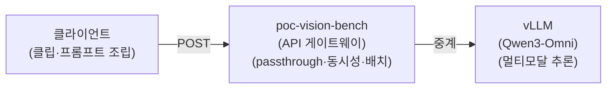

**검증 환경:**

AWS g7e.4xlarge(VRAM 96G) vLLM 서빙 / Qwen3-Omni-30B-A3B-Instruct(Qwen 멀티 모달 모델)

## 1. 프로젝트 개요

- 영상 분석 파이프라인
  - **클라이언트 →** `poc-vision-bench` **(API 서버) → vLLM(Qwen3-Omni)**

  - **위 플로우가 정상 동작하는지** 검증한다.
    - 분석 품질·파라미터 튜닝·정량 평가는 추후

- **검증 흐름:**



- **본 편에서 확인하는** `poc-vision-bench` **API 3종:**
  1. **상태 조회** : `/healthz`

  1. **단일 호출** : `/chat`

  1. **배치 처리 :** `/chat/batch`

## 2. 사전 조사

#### **2.1. 분석 모델: Qwen3-Omni-30B-A3B-Instruct**

- 6초 멀티모달 클립의 단일 호출 통합 분석을 위해 `Qwen3-Omni-30B-A3B-Instruct` 채택.
- Image / Video / Audio / Text 4 모달리티를 단일 모델로 처리하며 OpenAI 호환 vLLM 서빙이 가능한 거의 유일한 오픈소스 옵션. **Thinker–Talker MoE** 구조. 추론 코어(Thinker)가 총 30B / 활성 3B, Talker(음성)·오디오/비전 인코더 포함 전체 체크포인트 ≈ **35B** (본 PoC는 텍스트 출력만 사용 → Talker 미사용).

**모델 스펙**

| 항목 | 값 |
| --- | --- |
| 구조 | Thinker–Talker MoE (네이티브 옴니모달 end-to-end) |
| 파라미터 | 추론 코어(Thinker) 총 30B / 활성 3B · Talker·인코더 포함 전체 ≈ 35B |
| 입력 | 텍스트 · 이미지 · 오디오 · 비디오 |
| 출력 | 텍스트(+음성). 본 PoC는 텍스트만 사용(Talker 미사용) |
| 컨텍스트 | 네이티브 32,768 토큰 (실서빙은 16,384 운용) |
| 다국어 지원 | 텍스트 119개 / 음성입력 19개 / 음성출력 10개 → 한국어 모두 지원 |
| 라이선스 | Apache 2.0 (상용 가능) |

**VRAM / 실서빙 설정 (g7e.4xlarge · 1 GPU)**

| **항목** | **값** | **메모** |
| --- | --- | --- |
| GPU | NVIDIA RTX PRO 6000 Blackwell × 1 (96 GB) | 오레곤 us-west-2 |
| BF16 메모리(공식 카드) | 15초 78.85 GB / 30초 88.52 / 60초 107.74 | 6초 클립이라 96 GB에 충분 |
| `--dtype` | bfloat16 | 원본 정밀도(양자화 아님, 66 GiB 풀 체크포인트) |
| `--gpu-memory-utilization` | 0.85 (≈ 81.6 GB 할당) |  |
| `--tensor-parallel-size` | 1 | 단일 GPU |
| `--max-num-seqs` | 8 | 앱 동시성(4)보다 커서 여유 |

**각 항목 설명**

- **GPU - RTX PRO 6000 Blackwell × 1 (96 GB):** Blackwell 세대 서버용 GPU. 30B 모델을 풀 정밀도(BF16)로 KV 캐시·멀티모달 인코더까지 한 장에 올리려면 큰 VRAM 이 필요한데 96 GB 가 이를 감당한다.
- **BF16 메모리(공식 카드):** Qwen 모델 카드가 밝힌 *입력 영상 길이별* VRAM 요구량. 영상이 길수록 비디오 토큰이 늘어 메모리도 증가한다. 본 PoC 는 **6초 클립** 이라 96 GB에 여유.
- `--dtype bfloat16` **:** 양자화 없이 원본 정밀도 그대로 서빙(풀 체크포인트 ≈ 66 GiB). 품질 손실은 없지만 메모리를 많이 쓴다.
- `--gpu-memory-utilization 0.85` **:** vLLM 이 GPU 메모리의 85%(≈ 81.6 GB)를 가중치 + KV 캐시용으로 선점하는 비율. 높이면 동시 처리량(KV 캐시)이 늘지만 OOM 위험이 커지고, 낮추면 안전하나 처리량이 준다.
- `--tensor-parallel-size 1` **:** 모델을 GPU 여러 장에 쪼개지 않고 한 장에 통째로 올린다.
- `--max-num-seqs 8` **:** vLLM 이 동시에 처리하는 요청(시퀀스) 최대 수 = 내부 배치 상한. 게이트웨이(API Server) 동시성(4)보다 커서 vLLM 에 여유가 있다.

:::note
📍 **이 설정들은 어디에 있나**

`--dtype` , `--gpu-memory-utilization` , `--tensor-parallel-size` , `--max-num-seqs` 는 **vLLM 서버 기동 인자.**
:::

#### **2.2. 입력 방식:** `from_video` **(mp4 단일 입력) vs** `from_frames_audio` **(분리 입력)**

- 6초 mp4 한 덩어리를 `video_url` (base64 data) 한 컴포넌트로 그대로 넘기는 `from_video` 방식 채택.
- Qwen3-Omni 는 use_audio_in_video 로 영상+오디오 통합 이해를 네이티브 지원하므로, mp4 한 덩어리를 그대로 넘기는 from_video가 모델 권장 입력 방식이자 파이프라인이 가장 단순하다. 분리 입력은 컴포넌트가 4개로 늘고 키프레임 사이 동작 누락·정렬 부담이 있어 보류.

| **비교 항목** | `from_video` **(채택)** | `from_frames_audio` **(보류)** |
| --- | --- | --- |
| **입력 구성** | mp4 한 파일 → `video_url` (data URI) 1 컴포넌트 | 키프레임 JPG N장 + WAV 1 개 → 컴포넌트 4 개 |
| **시간 정렬** | 영상·오디오가 컨테이너 안에서 자동 동기 | 클라이언트 측 별도 정렬 보장 필요 |
| **전처리 산출물 용량** | 6초 mp4 (\~1\~3 MB / 클립) | frames JPG 3 장 + wav (\~수백 KB / 클립) |
| **환각 영향** | 영상·오디오 정렬·맥락 자연 유지 | 키프레임 사이 동작 누락 가능성 |

## 3. 테스트

##### 테스트 방법

클라이언트 → API 서버 → vLLM 의 **기본 동작** 을 아래 6단계로 확인한다.

1. **샘플 데이터 준비**
   - 테스트 영상 데이터를 준비하고 10분 구간을 6초 클립 100개로 분할한다.

   - ffmpeg 으로 **오디오는 남기고 화면만 검게 가린** 클립을 만들어 둔다(음성-전용 분석 검증용).

2. **분석 서버 실행**
   - 클립을 받아 vLLM 으로 중계할 `poc-vision-bench` 를 띄운다.

3. **단일 추론 호출** (`/chat` )
   1. 텍스트만

   1. 영상 + 프롬프트 

   1. 화면만 블랙아웃(영상 + 프롬프트와 동일 프롬프트)  음성 반영 확인

4. **배치 추론 호출** (`/chat/batch` )
   - 여러 클립(영상 + 프롬프트)을 한 요청으로 보내 다건 동시 처리를 확인한다.

5. **결과 저장**
   - 호출별 응답과 처리 통계(성공 여부·소요 시간)를 기록한다.

6. **요약·평가**
   - 각 API 가 정상 동작했는지 한눈에 정리한다.

### 3.1. 테스트 데이터

테스트에 사용된 원본 데이터는 아래와 같다. 가능한 실제 방송 영상과 비슷한 50분\~2시간 사이로 영상.

| 카테고리 | **방송** | **재생시간** | **URL** |
| --- | --- | --- | --- |
| news | KBS 9 뉴스 | 48:30 | [https://www.youtube.com/watch?v=rX1P-jOoNmM](https://www.youtube.com/watch?v=rX1P-jOoNmM) |
| docu | 슈퍼피쉬 1부 | 58:40 | [https://www.youtube.com/watch?v=iNbWqC1iqKw](https://www.youtube.com/watch?v=iNbWqC1iqKw) |
| drama | KBS 겨울 연가 | 1 :04:52 | [https://www.youtube.com/watch?v=irVKEhb9g8M](https://www.youtube.com/watch?v=irVKEhb9g8M) |
| hist_drama | 태조 왕건 | 54:10 | [https://www.youtube.com/watch?v=nmlE2iPWLGM](https://www.youtube.com/watch?v=nmlE2iPWLGM) |
| entertain | 출장십오야 X 스타쉽 전국체전 풀버전 | 1 :00:06 | [https://www.youtube.com/watch?v=6wJGpi1nkCg](https://www.youtube.com/watch?v=6wJGpi1nkCg) |
| baseball | 2009 프로야구 한국시리즈 7차전 | 1 :55:22 | [https://www.youtube.com/watch?v=fP1QEs1Uj5U](https://www.youtube.com/watch?v=fP1QEs1Uj5U) |
| esports | **2024 LCK SUMMER 결승전 GEN vs HLE** | 2 :11:23 | [https://www.youtube.com/watch?v=_A_I75nJMF8](https://www.youtube.com/watch?v=_A_I75nJMF8) |

데이터 준비 절차

위 표의 영상 데이터를 준비합니다.

1. 원본 데이터 준비
   - 작업 루트의 `data/raw/{category}/{name}` 에 각 영상 준비.

   - 카테고리는 다음과 같다. baseball(야구), docu(다큐멘터리), drama (드라마), entertain(예능), esports(e스포츠), hist_drama(사극), news(뉴스)

2. **6초 클립 분할**
   - 각 영상의 `00:10:00~00:20:00` 구간을 6초 100개 클립으로 분할.

   - `data/clips/{category}/{원본명}/{seq}_{start}-{end}.mp4`

```bash
cd "$(git rev-parse --show-toplevel)"
TARGETS=(
  "baseball baseball.mp4"
  "docu docu.mp4"
  "drama drama.mp4"
  "entertain entertain.mp4"
  "esports lol.mp4"
  "hist_drama hist_drama.mp4"
  "news news.mp4"
)
for target in "${TARGETS[@]}"; do
  read -r CAT NAME <<< "$target"
  BASE="${NAME%.mp4}"
  SRC="data/raw/$CAT/$NAME"
  OUT="data/clips/$CAT/$BASE"; mkdir -p "$OUT"
  [ -f "$SRC" ] || { echo "! 원본 없음, 건너뜀: $SRC"; continue; }
  echo "▶ $CAT/$BASE 분할 시작"
  for i in $(seq 0 99); do
    start=$((600 + i*6)); end=$((start + 6))
    name=$(printf "%04d_%04d-%04d" $((i+1)) "$start" "$end")
    ffmpeg -nostdin -ss "$start" -i "$SRC" -t 6 \
      -c:v libopenh264 -b:v 1500k -c:a aac -movflags +faststart \
      "$OUT/$name.mp4"
  done
done
```

3. **화면 블랙아웃** (음성 전용 검증용)
   - 분할된 첫 클립의 화면만 검게 가리고 오디오는 그대로 둔 클립 1개 생성

   - `data/blackout/{category}/{원본명}/`

```bash
cd "$(git rev-parse --show-toplevel)"
TARGETS=(
  "baseball baseball.mp4"
  "docu docu.mp4"
  "drama drama.mp4"
  "entertain entertain.mp4"
  "esports lol.mp4"
  "hist_drama hist_drama.mp4"
  "news news.mp4"
)
for target in "${TARGETS[@]}"; do
  read -r CAT NAME <<< "$target"
  BASE="${NAME%.mp4}"
  OUT="data/clips/$CAT/$BASE"
  BLACK="data/blackout/$CAT/$BASE"; mkdir -p "$BLACK"
  clips=( "$OUT"/*.mp4 )
  FIRST="${clips[0]}"
  [ -f "$FIRST" ] || { echo "! 분할 클립 없음, 건너뜀: $OUT"; continue; }
  echo "▶ $CAT/$BASE 블랙아웃 → $(basename "$FIRST")"
  ffmpeg -nostdin -i "$FIRST" \
    -vf "drawbox=0:0:iw:ih:color=black:t=fill" \
    -c:v libopenh264 -b:v 300k -c:a copy \
    "$BLACK/$(basename "$FIRST")"
done
```

:::note
⚡ **한 번에 실행** 

`./script/prepare_data.sh <카테고리> <파일명>`

- 이미 확보한 `data/raw` 원본을 대상으로 클립 분할·블랙아웃만 수행(원본은 손대지 않음).
:::


**최종 테스트 클립 데이터**

| **카테고리 키** | **장르** | **클립 수** | **해상도** | **fps** | **평균 크기** | **비고** |
| --- | --- | --- | --- | --- | --- | --- |
| `news` | 뉴스 | 100 | 1920×1080 | 30 | 1.17 MB | 자막·앵커 멘트 비중 높음 |
| `docu` | 다큐 | 100 | 1920×1080 | 30 | 1.62 MB | 내레이션 + 자연·현장음 혼합 |
| `baseball` | 야구 중계 | 100 | 640×360 | 29.97 | 1.13 MB | 캐스터 + 관중 함성 + 전광판 UI |
| `entertain` | 예능 | 100 | 1920×1080 | 29.97 | 1.15 MB | 여러 사람들 대화 + 자막 효과 |
| `drama` | 현대 드라마 | 100 | 720×480 | 29.97 | 1.10 MB | 인물 대사 + BGM |
| `hist_drama` | 사극 | 100 | 1920×1080 | 29.97 | 1.23 MB | 시대 의상·소품 + 문어체 대사 |
| `esports` | e스포츠 | 100 | 1920×1080 | **60** | 1.35 MB | 게임 UI 오버레이 + 캐스터 + 게임음 |
| **합계** | - | **700** | - | - | ≈ 1.25 MB | 원본 영상 7편 (장르당 1편, 10분 윈도우 100 등분) |

:::warning
🔒 **데이터 취급 원칙**

- 영상은 **내부 품질 평가(PoC) 목적에 한해** 사용하며, 외부로 배포·재공개하지 않는다.
- 영상·분석 결과는 코드 저장소에 **포함하지 않는다**
- 가공 사본을 별도 보관하지 않는다.
- 평가 종료 후 로컬 영상·산출물은 보관기간 정책에 따라 **폐기** 한다.
:::


### 3.2. 분석 서버 (vLLM 앞단 API 게이트웨이)

분석 요청을 받아 vLLM 에 중계하는 경량 서버. 진입점은 `src/app.py` (`PYTHONPATH=src uv run uvicorn app:app --port 8001` ). 대화형 API 문서는 `/docs` (Swagger)·`/redoc` ·`/openapi.json` 로 제공.

#### 3.2.1. 설계

- 서버 `poc-vision-bench` 는 vLLM `/v1/chat/completions` 앞단의 **얇은 게이트웨이** (FastAPI).
- 추론은 vLLM 이 전담하고, 서버는 요청 본문을 변형 없이 패스하며 **3가지만** 부가한다.
  1. Semaphore 동시성 게이트

  1. 배치 NDJSON 스트리밍(실시간 확인)

  1. request_id 로깅(`X-Request-Id` 헤더). 프롬프트 조립·base64 인코딩·`response_format` 스키마 강제·응답 검증은 **모두 클라이언트** 에서 한다.

- 게이트웨이를 passthrough로 두면 실험 변형(프롬프트·스키마·fps·샘플링)을 **클라이언트에서만** 수정.
- 서버는 vLLM 보호(동시성 상한)와 다건 효율(fan-out 스트리밍)만 보장.
- 업스트림 호출은 OpenAI SDK 가 아니라 raw `httpx` 로 그대로 vLLM 추론에 제공.

#### 3.2.2. 동시성 · 백프레셔

- vLLM 업스트림 호출은 `asyncio.Semaphore(VLLM_CONCURRENCY)` (기본 4개) 로 게이트한다. 초과 요청은 **거부하지 않고 대기** .
- `/chat` , `/chat/batch` 가 **같은 Semaphore 공유** → 두 라우트의 처리 중 작업이 상한 이하로 유지.
- Semaphore 는 FastAPI lifespan 에서 1회 생성해 `app.state`  주입(런타임 변경 X).
- `VLLMClient.chat()` 이 Semaphore 를 획득한 **뒤** `time.monotonic()` 으로 측정 → 반환 `elapsed_ms` 는 **큐 대기만 제외한 vLLM 호출 왕복(네트워크 + 추론) 시간** .

**서버 설정 (** `.env` **→** `Settings` **)**

| **키** | **기본** | **역할** |
| --- | --- | --- |
| `VLLM_BASE_URL` | - | vLLM `/v1` 엔드포인트 |
| `VLLM_CONCURRENCY` | 4 | 동시 호출 상한(Semaphore). 권장 1\~8 |
| `MAX_BATCH_ITEMS` | 128 | `/chat/batch` 한 요청의 최대 items |
| `VLLM_TIMEOUT_SECONDS` | 600s | 업스트림 호출 타임아웃 |
| `VLLM_ACQUIRE_TIMEOUT_SECONDS` | 300s | 세마포어 퍼밋 획득 최대 대기(초). 초과 시 그 요청만 실패 처리. |

#### 3.2.3. 배치 NDJSON 스트리밍

- `/chat/batch` 는 다건을 받아 fan-out 후 **완료 순서** 로 한 줄씩 흘린다.
- 입력 순서가 아니므로 `id` 로 매칭하며, 한두 건이 실패해도 나머지는 계속 진행한다.
- 백프레셔, 데드락 방지 : 동시 처리 수는 세마포어 퍼밋으로 제한한다. 퍼밋이 다 차면 새 요청은 빌 때까지 대기한다. 끊긴 요청이 퍼밋을 붙든 채 남으면 게이트웨이가 멈출 수 있어, 두 단계로 회수한다:
  1. 스트리밍 루프가 0.5초마다 request.is_disconnected()로 연결을 확인 → 끊기면 진행 중 작업을 취소하고 퍼밋을 즉시 반납한다.

  1. 끊김 신호가 안 오는 half-open 연결은 퍼밋 획득 타임아웃(`VLLM_ACQUIRE_TIMEOUT_SECONDS` , 기본 300초)으로 해당 요청만 실패시켜 퍼밋을 회수한다.

요청 본문:

```json
{"items": [
  {"id": "0001_0600-0606", "body": {<vLLM chat.completions body - /chat 와 동일>}},
  {"id": "0002_0606-0612", "body": {<...>}}
]}
```

응답 (라인 1개 = JSON 객체 1개, 줄바꿈 구분):

```json
{"id": "0001_0600-0606", "status": 200, "elapsed_ms": 3104, "body": {<vLLM 응답>}}
{"id": "0002_0606-0612", "status": 500, "elapsed_ms": 0, "error": "<메시지>"}
```

| **필드** | **의미** |
| --- | --- |
| `id` | 클라가 보낸 식별자(보통 clip_id). vLLM 이 발급하는 `body.id` (`chatcmpl-…` ) 와 의미가 다름 |
| `status` | 200=성공 / vLLM 4xx·5xx 그대로 / 500=서버측 예외(네트워크 끊김 등) |
| `elapsed_ms` | Semaphore 획득 후 vLLM 응답 완료까지(큐 대기 제외). 예외 시 0 |
| `body` / `error` | 성공 시 vLLM 응답 본문 / 실패 시 에러 메시지 |

- **제약:** `len(items) ≤ MAX_BATCH_ITEMS` (기본 128). 초과 시 즉시 **413** (NDJSON 시작 X, 단일 JSON 에러). 응답 헤더에 `X-Batch-Total` (받은 items 수) 동봉.

#### 3.2.4. 서버 실행

서버는 `script/service.sh` 로 관리한다.

```bash
./script/service.sh start      # 백그라운드 기동 (healthz OK 까지 대기)
./script/service.sh status     # PID·healthz·포트 확인
./script/service.sh restart    # stop → start
./script/service.sh stop
```

- 직접 실행: `PYTHONPATH=src uv run uvicorn app:app --host 0.0.0.0 --port 8001`

#### 3.2.5. API 입출력 예시

| **Method** | **Path** | **역할** | **비고** |
| --- | --- | --- | --- |
| GET | `/healthz` | 헬스체크 | lifespan 통과 후 항상 200. 업스트림 도달 여부는 검사 X |
| POST | `/chat` | 단건 passthrough | vLLM body 그대로 → 응답 그대로. 업스트림 도달 불가 시 502 |
| POST | `/chat/batch` | 다건 NDJSON 스트리밍 | 완료 순서로 라인별 흘림  |

1. `/healthz`

```json
{"ok": true}
```

2. `/chat` (단건)
- 입력: 클라가 조립한 vLLM body (base64 영상 + 프롬프트 + strict schema). 멀티모달 옵션은 **두 키로 분리.** 프레임 샘플링은 `media_io_kwargs.video` (`fps` 또는 `num_frames` , vLLM I/O 로더), 오디오 통합은 `mm_processor_kwargs.use_audio_in_video` .

```json
{
  "model": "qwen",
  "messages": [{"role": "user", "content": [
    {"type": "video_url", "video_url": {"url": "data:video/mp4;base64,<...>"}},
    {"type": "text", "text": "<프롬프트>"}
  ]}],
  "temperature": 0.3, "max_tokens": 1024,
  "response_format": {"type": "json_schema", "json_schema": {"name": "clip_analysis", "strict": true, "schema": "<AnalysisResult 4필드>"}},
  "media_io_kwargs": {"video": {"fps": 2.0}},
  "mm_processor_kwargs": {"use_audio_in_video": true},
  "chat_template_kwargs": {"enable_thinking": false}
}
```

- 출력: vLLM 응답 그대로 `choices[0].message.content` 에 strict JSON 문자열:

```json
{
  "id": "chatcmpl-...",
  "choices": [{"message": {"role": "assistant", "content": "<아래 JSON>"}, "finish_reason": "stop"}]
}
```

> 실행: `./script/curl_examples.sh chat`

3. `/chat/batch` (다건) 입력: `{items:[{id, body}, …]}` (각 body = ②와 동일)

```json
{"items": [
  {"id": "0001_0600-0606", "body": {"<②와 동일>"}},
  {"id": "0002_0606-0612", "body": {"..."}}
]}
```

출력: `application/x-ndjson`  완료 순서로 한 줄씩 (필드 상세 3.2.3):

```javascript
{"id":"0001_0600-0606","status":200,"elapsed_ms":3104,"body":{<vLLM 응답>}}
{"id":"0002_0606-0612","status":500,"elapsed_ms":0,"error":"<메시지>"}
```

> 실행: `./script/curl_examples.sh batch`


### 3.3. 테스트 실행 및 결과

클라이언트 → API 서버 → vLLM 파이프라인을 §3.0 흐름대로 실제 호출해 확인한다. (재현: `experiments/01_pipeline/api_check.py` )

#### 3.3.1. 상태 조회 (`GET /healthz` )

게이트웨이 생존 확인. lifespan 통과 후 항상 200 (업스트림 vLLM 도달 여부는 검사하지 않음).

```bash
$ curl -i http://localhost:8001/healthz
HTTP/1.1 200 OK
content-type: application/json
x-request-id: 6da1b40a

{"ok":true}
```

#### 3.3.2. 단일 추론 (`POST /chat` )

1. **텍스트추론**
   <details>
   <summary>요청</summary>

   ```bash
   curl -sS -X POST http://localhost:8001/chat \
     -H "Content-Type: application/json" \
     -d '{
       "model": "qwen",
       "messages": [{"role": "user", "content": [
         {"type": "text", "text": "한국어로 자기소개를 한 문장으로 해줘."}
       ]}]
     }' | jq
   ```


   </details>

   <details>
   <summary>응답</summary>

   ```json
   {
     "id": "chatcmpl-a4e66116bd600be3",
     "object": "chat.completion",
     "created": 1780911108,
     "prompt_routed_experts": null,
     "model": "qwen",
     "choices": [
       {
         "index": 0,
         "message": {
           "role": "assistant",
           "content": "안녕하세요, 저는 한국어 모국어 화자이며 다양한 주제에 대해 자연스럽고 흥미로운 대화를 나누는 것을 좋아합니다.",
           "refusal": null,
           "annotations": null,
           "audio": null,
           "function_call": null,
           "tool_calls": [],
           "reasoning": null
         },
         "logprobs": null,
         "finish_reason": "stop",
         "stop_reason": null,
         "token_ids": null,
         "routed_experts": null
       }
     ],
     "service_tier": null,
     "system_fingerprint": "vllm-0.21.0-955d20dc",
     "usage": {
       "prompt_tokens": 23,
       "total_tokens": 63,
       "completion_tokens": 40,
       "prompt_tokens_details": null
     },
     "prompt_logprobs": null,
     "prompt_token_ids": null,
     "prompt_text": null,
     "kv_transfer_params": null
   }
   ```


   </details>

2. **영상 + 프롬프트**
   <details>
   <summary>요청 (curl)</summary>

   영상 base64 가 커서 payload 를 파일로 빌드 후 전송(`--data-binary` ). 영상의 **temperature** 는 **0.3** 권장(높은 값은 이종문자 degeneration 유발).

   ```bash
   REPO_DIR=$(git rev-parse --show-toplevel)
   CLIP=${REPO_DIR}/data/clips/baseball/baseball/0001_0600-0606.mp4
   PYTHONPATH=src uv run python - "$CLIP" <<'PY'
   import base64, json, sys
   b = base64.b64encode(open(sys.argv[1],"rb").read()).decode()
   json.dump({"model":"qwen","messages":[{"role":"user","content":[
       {"type":"video_url","video_url":{"url":"data:video/mp4;base64,"+b}},
       {"type":"text","text":"이 영상의 시각과 음성을 한국어로 분석해줘."}]}],
     "temperature":0.3,
     "mm_processor_kwargs":{"use_audio_in_video":True},
     "chat_template_kwargs":{"enable_thinking":False}}, open("/tmp/req.json","w"), ensure_ascii=False)
   PY
   curl -sS -X POST http://localhost:8001/chat -H "Content-Type: application/json" --data-binary @/tmp/req.json | jq
   ```


   </details>

   <details>
   <summary>응답 (JSON)</summary>

   ```json
   {
     "id": "chatcmpl-be4589ee14d26f36",
     "object": "chat.completion",
     "created": 1780911130,
     "prompt_routed_experts": null,
     "model": "qwen",
     "choices": [
       {
         "index": 0,
         "message": {
           "role": "assistant",
           "content": "assistant>\n이 영상은 야구 경기 중 한 장면을 담고 있습니다. 경기장 내부에서 촬영되었으며, 주로 투수와 타자, 그리고 포수의 위치가 보입니다. 투수와 포수는 모두 빨간색 유니폼을 입고 있으며, 타자도 빨간색 유니폼을 입고 있습니다. 배경에는 광고판이 보이며, \"Pocari Sweat\"와 \"Super Dong\" 등의 광고가 있습니다. 경기장의 분위기는 활기차며, 관중들의 함성 소리가 들립니다. \n\n음성은 한국어로 진행되며, 경기 중계 방송의 목소리가 들립니다. 중계 방송에서는 경기의 진행 상황을 설명하고 있으며, 특정 선수의 활약에 대해 언급합니다. \"MVP를 줄 수밖에 없지 않나\"라는 말이 들리며, 이는 특정 선수의 훌륭한 활약에 대한 평가로 보입니다. 또한 \"기아의 반격이 또 나왔습니다\"라는 말이 들리며, 이는 경기 중 상대 팀이 반격을 시도하고 있음을 나타냅니다. \n\n전반적으로 이 영상은 야구 경기의 긴박한 순간을 포착한 것으로, 팀의 활약과 경기의 흐름을 중계 방송을 통해 관객들에게 전달하고 있습니다.",
           "refusal": null,
           "annotations": null,
           "audio": null,
           "function_call": null,
           "tool_calls": [],
           "reasoning": null
         },
         "logprobs": null,
         "finish_reason": "stop",
         "stop_reason": null,
         "token_ids": null,
         "routed_experts": null
       }
     ],
     "service_tier": null,
     "system_fingerprint": "vllm-0.21.0-955d20dc",
     "usage": {
       "prompt_tokens": 3633,
       "total_tokens": 3974,
       "completion_tokens": 341,
       "prompt_tokens_details": null
     },
     "prompt_logprobs": null,
     "prompt_token_ids": null,
     "prompt_text": null,
     "kv_transfer_params": null
   }
   ```


   </details>

3. **블랙아웃 영상 + 프롬프트** (화면만 검게, 오디오 유지)
   <details>
   <summary>요청 (curl)</summary>

   위 [**2. 영상 + 프롬프트** ]와 **완전히 동일** (같은 프롬프트·`temperature 0.3` ), `CLIP` 만 화면을 검게 가린 클립으로 교체. 화면을 지워도 출력에 음성이 남으면 → 모델이 오디오를 실제로 처리

   ```bash
   REPO_DIR=$(git rev-parse --show-toplevel)
   CLIP=${REPO_DIR}/data/blackout/baseball/baseball/0001_0600-0606.mp4
   PYTHONPATH=src uv run python - "$CLIP" <<'PY'
   import base64, json, sys
   b = base64.b64encode(open(sys.argv[1],"rb").read()).decode()
   json.dump({"model":"qwen","messages":[{"role":"user","content":[
       {"type":"video_url","video_url":{"url":"data:video/mp4;base64,"+b}},
       {"type":"text","text":"이 영상의 시각과 음성을 한국어로 분석해줘."}]}],
     "temperature":0.3,
     "mm_processor_kwargs":{"use_audio_in_video":True},
     "chat_template_kwargs":{"enable_thinking":False}}, open("/tmp/req.json","w"), ensure_ascii=False)
   PY
   curl -sS -X POST http://localhost:8001/chat -H "Content-Type: application/json" --data-binary @/tmp/req.json | jq
   ```


   </details>

   <details>
   <summary>응답 (content)</summary>

   ```javascript
   {
     "id": "chatcmpl-afbd596bbaba2f3b",
     "object": "chat.completion",
     "created": 1780911151,
     "prompt_routed_experts": null,
     "model": "qwen",
     "choices": [
       {
         "index": 0,
         "message": {
           "role": "assistant",
           "content": "assistant\n이 영상은 흑백으로 전환된 장면을 보여줍니다. 화면에는 아무런 시각적 정보가 없으며, 오직 검은색 배경만 존재합니다. 이는 아마도 비디오의 일부가 손상되었거나, 또는 의도적으로 흑백으로 처리된 것으로 보입니다. \n\n음성은 한국어로 되어 있으며, 두 명의 남성이 대화를 나누고 있습니다. 첫 번째 남성은 \"MVP를 줄 수밖에 없지 않나?\"라고 말하며, 두 번째 남성은 \"그렇죠.\"라고 동의합니다. 이 대화는 아마도 스포츠 경기에 대한 논의일 수 있습니다. \n\n그러나 이 대화는 비디오의 시각적 정보와 연결되지 않으며, 시청자가 비디오의 내용을 이해하기 위해 음성 정보에만 의존해야 합니다. 이는 비디오의 시각적 정보가 부족하거나, 의도적으로 시청자의 주의를 음성 정보에 집중시키기 위한 전략일 수 있습니다.",
           "refusal": null,
           "annotations": null,
           "audio": null,
           "function_call": null,
           "tool_calls": [],
           "reasoning": null
         },
         "logprobs": null,
         "finish_reason": "stop",
         "stop_reason": null,
         "token_ids": null,
         "routed_experts": null
       }
     ],
     "service_tier": null,
     "system_fingerprint": "vllm-0.21.0-955d20dc",
     "usage": {
       "prompt_tokens": 3633,
       "total_tokens": 3885,
       "completion_tokens": 252,
       "prompt_tokens_details": null
     },
     "prompt_logprobs": null,
     "prompt_token_ids": null,
     "prompt_text": null,
     "kv_transfer_params": null
   }
   ```


   </details>

#### 3.3.3. 배치 추론 (`POST /chat/batch` )

같은 12클립·동일 파라미터(`temperature 0.3` , 측정 시점 서버 기본 샘플)로 **① 한 건씩** `/chat` **순차** vs **②** `/chat/batch` **일괄** 처리시간을 비교한다. (재현: `experiments/01_pipeline/batch_throughput.py` )

<details>
<summary>재현 요약 코드 (<code>batch_throughput.py</code> 핵심부)</summary>

```python
# experiments/01_pipeline/batch_throughput.py 핵심부 (같은 items 로 순차 vs 배치 비교)
import os, base64, json, time, httpx
from pathlib import Path

_HERE = Path(__file__).resolve().parent
_DATA = Path(os.environ.get("DATA_DIR") or _HERE.parent.parent / "data")
CLIPS_ROOT = _DATA / "clips"

SVR = "http://localhost:8001"
_SCENE = CLIPS_ROOT / "baseball/baseball"
CLIPS = [str(p.relative_to(CLIPS_ROOT)) for p in sorted(_SCENE.glob("*.mp4"))[:12]]  # 연속 12클립 (0001~0012)

def chat_body(clip):
    b64 = base64.b64encode(clip.read_bytes()).decode()
    return {"model": "qwen", "temperature": 0.3,
            "messages": [{"role": "user", "content": [
                {"type": "video_url", "video_url": {"url": f"data:video/mp4;base64,{b64}"}},
                {"type": "text", "text": "이 영상의 시각과 음성을 한국어로 분석해줘."}]}],
            "mm_processor_kwargs": {"use_audio_in_video": True},
            "chat_template_kwargs": {"enable_thinking": False}}

items = [{"id": Path(c).name, "body": chat_body(CLIPS_ROOT / c)} for c in CLIPS]  # base64 1회 인코딩 → 양 모드 재사용

with httpx.Client(timeout=600) as cli:
    # ① 순차: 한 건씩 /chat (앞 건 완료 후 다음)
    t = time.monotonic()
    for it in items:
        cli.post(f"{SVR}/chat", json=it["body"])
    seq_ms = int((time.monotonic() - t) * 1000)

    # ② 배치: /chat/batch 일괄 → 완료순 NDJSON 스트리밍
    t = time.monotonic()
    with cli.stream("POST", f"{SVR}/chat/batch", json={"items": items}) as r:
        for line in r.iter_lines():
            if line:
                json.loads(line)  # 라인 = {id, status, elapsed_ms, body|error}
    batch_ms = int((time.monotonic() - t) * 1000)

print(f"순차 {seq_ms}ms · 배치 {batch_ms}ms · {seq_ms / batch_ms:.2f}×")
```


</details>

| 모드 | 총 처리시간 | 성공 |
| --- | --- | --- |
| 순차 (한 건씩 `/chat` ) | 37536ms | 12/12 |
| 배치 (`/chat/batch` 일괄) | 22603ms | 12/12 |

배치가 순차보다 빠름(약 **1.7배** , 게이트웨이 동시성 `VLLM_CONCURRENCY=4` 만큼 fan-out 병렬. 빈출력/폭주 jitter 로 실행마다 배수는 변동). 도착 순서 ≠ 입력 순서(**완료순 스트리밍** ), `X-Batch-Total=12` . 다건 1요청·완료순 스트리밍·각 건 독립 `status` 모두 정상.

#### 3.3.4. 요약

§3.3 호출 결과를 한눈에. (출력 품질·정확도가 아니라 **파이프라인 정상 동작** 기준)

| 항목 | 라우트 | 검증 내용 | 핵심 결과 | 판정 |
| --- | --- | --- | --- | --- |
| 상태 조회 | GET /healthz | 게이트웨이 생존·X-Request-Id | x-request-id 부여 | ✅ PASS |
| 단일·텍스트 | POST /chat | 텍스트 추론 기본 동작 | 정상 1문장 (prompt 23·completion 25) | ✅ PASS |
| 단일·영상 | POST /chat | 영상+음성 통합 분석 | 한국어 장면 분석 | ✅ PASS |
| 단일·블랙아웃 | POST /chat | 화면 가려도 음성 반영(통제) | 검은 화면 인식 + 중계 음성 포착 | ✅ PASS |
| 배치 | POST /chat/batch | 다건 동시·완료순 스트리밍 | 완료순≠입력순, 배치처리가 약 1.7배 빠름 | ✅ PASS |

클라이언트 → `poc-vision-bench` → vLLM 파이프라인의 핵심 메커니즘(본문 패스스루·동시성 게이트·완료순 배치 스트리밍·영상 내 오디오 통합)이 모두 정상 동작함을 확인.

---

## 4. 참조 문서

**모델 — Qwen3-Omni**

- [Qwen3-Omni-30B-A3B-Instruct — Hugging Face 모델 카드](https://huggingface.co/Qwen/Qwen3-Omni-30B-A3B-Instruct) — 모달리티·컨텍스트·BF16 VRAM 표·라이선스·한국어 지원
- [Qwen3-Omni Technical Report (arXiv:2509.17765)](https://arxiv.org/abs/2509.17765) — Thinker–Talker MoE 구조, 오디오·AV 36개 중 32개 오픈소스 SOTA
- [QwenLM/Qwen3-Omni — GitHub](https://github.com/QwenLM/Qwen3-Omni) — 사용법, `use_audio_in_video` 영상·오디오 통합

**하드웨어 — AWS g7e**

- [Amazon EC2 G7e 인스턴스 (제품 페이지)](https://aws.amazon.com/ec2/instance-types/g7e/) — RTX PRO 6000 Blackwell, GPU당 96GB
- [G7e 출시 발표 (AWS News Blog)](https://aws.amazon.com/blogs/aws/announcing-amazon-ec2-g7e-instances-accelerated-by-nvidia-rtx-pro-6000-blackwell-server-edition-gpus/) — 2026-01 GA
- [g7e.4xlarge 스펙 — Vantage](https://instances.vantage.sh/aws/ec2/g7e.4xlarge) — 1 GPU / 96 GiB / 16 vCPU / 128 GiB

**서빙 — vLLM**

- [Qwen3-Omni vLLM 서빙 가이드](https://docs.vllm.ai/projects/vllm-omni/en/latest/user_guide/examples/online_serving/qwen3_omni/) — `vllm serve` 옵션 (`--max-model-len` 등)
- [vLLM — OpenAI-Compatible Server](https://docs.vllm.ai/en/latest/serving/openai_compatible_server.html) — `/v1/chat/completions` 규약·`response_format` ·extra body(`mm_processor_kwargs` ·`chat_template_kwargs` ). 게이트웨이가 이 본문을 그대로 패스

