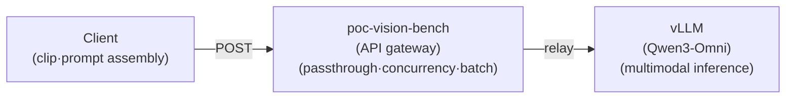

**Testing Environment:**

AWS g7e.4xlarge (96 GB VRAM) vLLM serving / Qwen3-Omni-30B-A3B-Instruct (Qwen multimodal model)

## 1. Project Overview

- Video Analysis Pipeline
  - **Client →** `poc-vision-bench` **(API Server) → vLLM (Qwen3-Omni)**

  - Verify **whether the above flow operates normally**.
    - Analysis quality, parameter tuning, and quantitative evaluation will be addressed later

- **Verification Flow:**



- **What we will verify in this section — 3 types of APIs:**
  1. **Status Query** — `/healthz`

  1. **Single Call** — `/chat` (Text inference, video inference, and verification of audio analysis during screen blackout)

  1. **Batch Processing** — `/chat/batch`

## 2. Preliminary Investigation

#### **2.1. Analysis Model: Qwen3-Omni-30B-A3B-Instruct**

- Adopted `Qwen3-Omni-30B-A3B-Instruct` for integrated analysis of 6-second multimodal clips via a single call.
- The nearly only open-source option capable of processing 4 modalities (Image / Video / Audio / Text) with a single model and supporting OpenAI-compatible vLLM serving. **Thinker–Talker MoE** architecture. The inference core (Thinker) totals 30B / 3B active; the full checkpoint, including Talker (speech), audio, and vision encoders, is ≈ **35B** (this PoC uses only text output → Talker not used).

**Model Specifications**

| Item | Value |
| --- | --- |
| Architecture | Thinker–Talker MoE (native omnimodal end-to-end) |
| Parameters | Total 30B for Inference Core (Thinker) / 3B active · Total ≈ 35B including Talker and encoders |
| Input | Text · Image · Audio · Video |
| Output | Text (+Speech) — This PoC uses text only (Talker not used) |
| Context | Native 32,768 tokens (16,384 used in production) |
| Multilingual Support | 119 languages for text / 19 for voice input / 10 for voice output → Full support for Korean |
| License | Apache 2.0 (Commercial use permitted) |

**VRAM / Production Settings (g7e.4xlarge · 1 GPU)**

| **Item** | **Value** | **Note** |
| --- | --- | --- |
| GPU | NVIDIA RTX PRO 6000 Blackwell × 1 (96 GB) | Oregon us-west-2 |
| BF16 Memory (Official Card) | 15 sec 78.85 GB / 30 sec 88.52 / 60 sec 107.74 | 96 GB is sufficient for a 6-second clip |
| `--dtype` | bfloat16 | Original precision (not quantized, 66 GiB full checkpoint) |
| `--gpu-memory-utilization` | 0.85 (≈ 81.6 GB allocated) |  |
| `--tensor-parallel-size` | 1 | Single GPU |
| `--max-num-seqs` | 8 | More than app concurrency (4), so plenty of headroom |

**Description of Each Item**

- **GPU - RTX PRO 6000 Blackwell × 1 (96 GB):** Blackwell-generation server GPU. To fit a 30B model in full precision(BF16), including the KV cache and multimodal encoder, requires a large amount of VRAM, which the 96 GB capacity handles.
- **BF16 Memory (Official Card):** VRAM requirements *by input video length* as stated in the Qwen model card. As the video length increases, the number of video tokens grows, leading to higher memory usage. Since this PoC uses a **6-second clip**, there is ample room within the 96 GB.
- `--dtype bfloat16` **:** Serving at full original precision without quantization (full checkpoint ≈ 66 GiB). There is no loss in quality, but it consumes a lot of memory.
- `--gpu-memory-utilization 0.85` **:** The ratio at which the vLLM preempts 85% (≈ 81.6 GB) of GPU memory for weights and KV cache. Increasing this boosts concurrent throughput(KV cache) increases, but the risk of OOM rises; lowering it ensures safety but reduces throughput.
- `--tensor-parallel-size 1` **:** The model is loaded entirely onto a single GPU without being split across multiple GPUs.
- `--max-num-seqs 8` **:** The maximum number of requests(sequences) that vLLM can process simultaneously = internal batch size limit. This is larger than the gateway (API Server) concurrency (4), so vLLM has some headroom.

:::note
📍 **Where are these settings located? - Distinguish between two locations**

- The `--dtype`, `--gpu-memory-utilization`, `--tensor-parallel-size`, and `--max-num-seqs` above are **vLLM server startup arguments** → They are found in the `vllm serve …` command of the service that launches vLLM on the serving host (This is on the **vLLM serving side**, not in our gateway repo).
- Our gateway’s (`poc-vision-bench`) own settings (`VLLM_BASE_URL`, `VLLM_CONCURRENCY`, etc.) are separate and located in `.env` **→** `src/config.py` **’s** `Settings`.
:::

#### **2.2. Input Method:** `from_video` **(single MP4 input) vs** `from_frames_audio` **(separate inputs)**

- Adopted the method of passing a single 6-second MP4 file as-is as a single component (base64 data).
- Since Qwen3-Omni natively supports the integrated interpretation of video and audio via `use_audio_in_video`, passing a single MP4 file as-is via `from_video` is the model’s recommended input method and results in the simplest pipeline. Separate input is on hold because it increases the number of components to four and introduces the burden of missing motion between keyframes and alignment.

| **Comparison Item** | `from_video` **(Adopted)** | `from_frames_audio` **(On Hold)** |
| --- | --- | --- |
| **Input Configuration** | Single MP4 file → `video_url` (data URI) 1 component | N keyframe JPGs + 1 WAV file → 4 components |
| **Timing Alignment** | Video and audio automatically synchronized within the container | Requires separate client-side alignment |
| **Preprocessing Output Size** | 6-second MP4 (~1–3 MB per clip) | 3 JPG frames + WAV (~hundreds of KB per clip) |
| **Hallucination Impact** | Video and audio alignment and context naturally maintained | Possible motion gaps between keyframes |

## 3. Testing

### 3.0. Testing Method

Verify the **basic operation** of Client → API Server → vLLM through the following 6 steps. (Analysis *quality* evaluation will follow later.)

1. **Preparing Sample Data**
   - Prepare test video data and split a 10-minute segment into 100 6-second clips.

   - Use ffmpeg to create clips that **retain the audio but black out the video** (for voice-only analysis verification).

2. **Run the analysis server**
   - Launch the API gateway (`poc-vision-bench`) that receives clips and relays them to the vLLM.

3. **Single Inference Call** (`/chat` )
   1. Text only

   1. Video + prompt

   1. Screen blacked out only (same prompt as ⓑ) — Verify audio processing

4. **Batch Inference Call** (`/chat/batch` )
   - Send multiple clips (video + prompt) in a single request to verify batch processing.

5. **Save Results**
   - Record responses and processing statistics (success/failure, elapsed time) for each call.

6. **Summary and Evaluation**
   - Summarize at a glance whether each API functioned normally.

### 3.1. Test Data

The source data used for testing is as follows. Videos ranging from 50 minutes to 2 hours in length, as similar as possible to actual broadcast footage.

| **Broadcast** | **Duration** | **URL** |
| --- | --- | --- |
| KBS 9 News | 48:30 | [https://www.youtube.com/watch?v=rX1P-jOoNmM](https://www.youtube.com/watch?v=rX1P-jOoNmM) |
| Superfish Part 1 | 58:40 | [https://www.youtube.com/watch?v=iNbWqC1iqKw](https://www.youtube.com/watch?v=iNbWqC1iqKw) |
| KBS Winter Sonata | 1:04:52 | [https://www.youtube.com/watch?v=irVKEhb9g8M](https://www.youtube.com/watch?v=irVKEhb9g8M) |
| Taejo Wang Geon | 54:10 | [https://www.youtube.com/watch?v=nmlE2iPWLGM](https://www.youtube.com/watch?v=nmlE2iPWLGM) |
| Chuljang Sipo-ya X Starship National Sports Festival Full Version | 1:00:06 | [https://www.youtube.com/watch?v=6wJGpi1nkCg](https://www.youtube.com/watch?v=6wJGpi1nkCg) |
| 2009 KBO League Korean Series Game 7 | 1:55:22 | [https://www.youtube.com/watch?v=fP1QEs1Uj5U](https://www.youtube.com/watch?v=fP1QEs1Uj5U) |
| **2024 LCK Summer Finals: GEN vs HLE** | 2:11:23 | [https://www.youtube.com/watch?v=_A_I75nJMF8](https://www.youtube.com/watch?v=_A_I75nJMF8) |

**Download Original (Reproduction Procedure)**

The original file from the table above can be downloaded using the procedure below and is located in `data/raw/{category}/`.

- **Prerequisites**: Install `uv` (→ `uvx` ) and `ffmpeg` (ffmpeg is required for merging video and audio streams)
1. **Download the Original** — Save each URL from the table to its corresponding category folder

```bash
cd "$(git rev-parse --show-toplevel)"   # Change to the working directory (top level of the repo)
CAT=<Category>; NAME=<Original Name>; URL=<URL to Test>
uvx yt-dlp -f "bv*[ext=mp4]+ba[ext=m4a]/b[ext=mp4]/b" \
--merge-output-format mp4 \
-o "data/raw/$CAT/$NAME.%(ext)s" "$URL"
```

2. **Split into 6-second clips** (preparation)
- Split the `00:10:00~00:20:00` segment (original 600–1200s) into 100 clips of 6 seconds each. Encode the original absolute seconds into the filename
- `data/clips/{category}/{원본명}/{seq}_{start}-{end}.mp4`

```bash
cd "$(git rev-parse --show-toplevel)"
CAT=<Category>; NAME=<Original Name>
SRC="data/raw/$CAT/$NAME.mp4"
OUT="data/clips/$CAT/$NAME"; mkdir -p "$OUT"
for i in $(seq 0 99); do
  start=$((600 + i*6)); end=$((start + 6))  # Absolute seconds: 600, 606, …, 1194
  name=$(printf "%04d_%04d-%04d" $((i+1)) "$start" "$end")  # 0001_0600-0606
  ffmpeg -nostdin -ss "$start" -i "$SRC" -t 6 -c:v libopenh264 -b:v 1500k -c:a aac -movflags +faststart "$OUT/$name.mp4"
done
```

3. **Screen Blackout** (for audio-only verification)
   - Create one clip where only the screen of the first split clip is blacked out while keeping the audio intact

   - `data/blackout/{category}/{원본명}/`

```bash
cd "$(git rev-parse --show-toplevel)"
CAT=<Category>; NAME=<Original Name>
OUT="data/clips/$CAT/$NAME"
FIRST=$(ls "$OUT"/*.mp4 | head -1) # Only one split clip
BLACK="data/blackout/$CAT/$NAME"; mkdir -p "$BLACK"
ffmpeg -nostdin -i "$FIRST" \
  -vf "drawbox=0:0:iw:ih:color=black:t=fill" \
  -c:v libopenh264 -b:v 300k -c:a copy "$BLACK/$(basename "$FIRST")"
```

:::note
⚡ **Run All at Once** 

- Script to automate the above tasks

`./script/prepare_data.sh <카테고리> <파일명> <URL>`

- Skips download if the original already exists (to protect the original).
:::

**Final Test Clip Data**

| **Category Key** | **Genre** | **Number of Clips** | **Resolution** | **fps** | **Average Size** | **Remarks** |
| --- | --- | --- | --- | --- | --- | --- |
| `news` | News | 100 | 1920×1080 | 30 | 1.17 MB | High proportion of subtitles and anchor commentary |
| `docu` | Documentary | 100 | 1920×1080 | 30 | 1.62 MB | Narration + mix of nature and on-site sounds |
| `baseball` | Baseball Broadcast | 100 | 640×360 | 29.97 | 1.13 MB | Commentator + Crowd Cheers + Scoreboard UI |
| `entertain` | Variety Show | 100 | 1920×1080 | 29.97 | 1.15 MB | Group conversation + subtitle effects |
| `drama` | Contemporary Drama | 100 | 720×480 | 29.97 | 1.10 MB | Character Dialogue + BGM |
| `hist_drama` | Historical Drama | 100 | 1920×1080 | 29.97 | 1.23 MB | Period Costumes & Props + Formal Dialogue |
| `esports` | Esports | 100 | 1920×1080 | **60** | 1.35 MB | Game UI overlay + Caster + Game audio |
| **Total** | — | **700** | — | — | ≈ 1.25 MB | 7 original videos (1 per genre, 10-minute window divided into 100 segments) |

:::warning
🔒 **Data Handling Principles**

- Videos are used **solely for internal quality assessment (PoC) purposes** and will not be distributed or republished externally.
- Videos and analysis results **will not be included** in the code repository
- Do not store processed copies separately.
- After evaluation is complete, local videos and outputs must be **disposed of** in accordance with retention policies.
:::

### 3.2. Analysis Server (vLLM Frontend API Gateway)

A lightweight server that receives analysis requests and relays them to the vLLM. The entry point is `src/app.py` (`PYTHONPATH=src uv run uvicorn app:app --port 8001`). Interactive API documentation is provided via `/docs` (Swagger), `/redoc`, and `/openapi.json`.

#### 3.2.1. Design

- The server `poc-vision-bench` is a **thin gateway** (FastAPI) in front of the vLLM `/v1/chat/completions`.
- Inference is handled exclusively by the vLLM; the server passes the request body through without modification, adding **only three** elements.
  1. Semaphore concurrency gate

  1. Batch NDJSON streaming (real-time verification)

  1. Logging the request_id (`X-Request-Id` header). Prompt assembly, base64 encoding, `response_format` schema enforcement, and response validation are all performed **on the client**.

- If the gateway is set to passthrough, experimental variations (prompt, schema, fps, sampling) are modified **only on the client**.
- The server guarantees only vLLM protection (concurrency cap) and multi-request efficiency (fan-out streaming).
- Upstream calls are provided directly to vLLM inference as raw `httpx`, not via the OpenAI SDK.

#### 3.2.2. Concurrency · Backpressure

- vLLM upstream calls are gated by `asyncio.Semaphore(VLLM_CONCURRENCY)` (default 4). Excess requests are **not rejected but queued** .
- `/chat` and `/chat/batch` **share the same semaphore** → Ensures the number of active tasks across both routes remains below the limit.
- The semaphore is created once during the FastAPI lifecycle and injected into `app.state` (no runtime changes).
- **After** `VLLMClient.chat()` acquires the Semaphore, it is measured by `time.monotonic()` → The returned `elapsed_ms` value represents the **round-trip time (network + inference) of the vLLM call, excluding queue wait time**.

**Server Configuration (** `.env` **→** `Settings` **)**

| **Key** | **Default** | **Role** |
| --- | --- | --- |
| `VLLM_BASE_URL` | — | vLLM `/v1` endpoint |
| `VLLM_CONCURRENCY` | 4 | Concurrent call limit (Semaphore). Recommended 1–8 |
| `MAX_BATCH_ITEMS` | 128 | `/chat/batch` Maximum items per request |
| `VLLM_TIMEOUT_SECONDS` | 600s | Upstream call timeout |
| `VLLM_ACQUIRE_TIMEOUT_SECONDS` | 300s | Maximum wait time (seconds) for acquiring a semaphore permit. If exceeded, only that request is marked as failed → Deadlock backstop due to permit leakage or half-open (unreceived FIN from disconnected client) |

#### 3.2.3. Batch NDJSON Streaming

- `/chat/batch` receives multiple items, performs fan-out (`asyncio.create_task`), and then streams them one line at a time in **completion order** (`asyncio.wait(..., return_when=FIRST_COMPLETED)`) (`application/x-ndjson`, chunked). Since this is not input order, it matches using `id`; even if one or two items fail, the rest continue (determined by `status` on each line).
- **Backpressure and Deadlock Hardening:** The streaming loop checks client survival every 0.5 seconds using `request.is_disconnected()`; if the client disconnects (FIN received), it cancels all in-flight tasks and immediately releases the semaphore permit. In cases where a disconnection cannot be detected, such as with a half-open connection (where a FIN has not been received), the system waits until the **permit acquisition timeout** (`VLLM_ACQUIRE_TIMEOUT_SECONDS`, default 300s) is reached, and only that request is marked as failed → This prevents deadlocks where a disconnected thread permanently holds the permit, causing the gateway to freeze.

Request Body:

```json
{"items": [
  {"id": "0001_0600-0606", "body": {<vLLM chat.completions body — same as /chat>}},
  {"id": "0002_0606-0612", "body": {<...>}}
]}
```

Response (1 line = 1 JSON object, separated by line breaks):

```json
{"id": "0001_0600-0606", "status": 200, "elapsed_ms": 3104, "body": {<vLLM response>}}
{"id": "0002_0606-0612", "status": 500, "elapsed_ms": 0, "error": "<message>"}
```

| **Field** | **Meaning** |
| --- | --- |
| `id` | Identifier sent by the client (usually clip_id). Different from the `body.id` (`chatcmpl-…`) issued by vLLM |
| `status` | 200=Success / vLLM 4xx·5xx as-is / 500=Server-side exception (network disconnection, etc.) |
| `elapsed_ms` | Time from semaphore acquisition to completion of vLLM response (excluding queue wait). 0 on exception |
| `body` / `error` | vLLM response body on success / error message on failure |

- **Constraint:** `len(items) ≤ MAX_BATCH_ITEMS` (default 128). If exceeded, immediately return **413** (NDJSON not started, single JSON error). Include `X-Batch-Total` (number of received items) in the response header.

#### 3.2.4. Server Execution

The gateway is managed via `script/service.sh`.

```bash
./script/service.sh start # Start in the background (wait until healthz returns OK)
./script/service.sh status     # Check PID, health status, and port
./script/service.sh restart    # stop → start
./script/service.sh stop
```

- Direct execution: `PYTHONPATH=src uv run uvicorn app:app --host 0.0.0.0 --port 8001`
- vLLM connection and concurrency: `.env` (→ 3.2.2). Interactive Documentation: `/docs` (Swagger)

#### 3.2.5. API Input/Output Examples

| **Method** | **Path** | **Role** | **Remarks** |
| --- | --- | --- | --- |
| GET | `/healthz` | Health Check | Always returns 200 after the lifespan expires. Does not check if the upstream is reached |
| POST | `/chat` | Single-item passthrough | vLLM body as-is → Response as-is. Returns 502 if the upstream cannot be reached |
| POST | `/chat/batch` | Multi-item NDJSON streaming | Streamed line by line in completion order (see 3.2.3) |

1. `/healthz`

```json
{"ok": true}
```

2. `/chat` (Single)
- Input: vLLM body assembled by the client (base64 video + prompt + strict schema). Multimodal options are **separated by two keys** — frame sampling is handled by `media_io_kwargs.video` (`fps` or `num_frames`, vLLM I/O loader), and audio integration is handled by `mm_processor_kwargs.use_audio_in_video` (HF processor).

```json
{
  "model": "qwen",
  "messages": [{"role": "user", "content": [
    {"type": "video_url", "video_url": {"url": "data:video/mp4;base64,<...>"}},
    {"type": "text", "text": "<Prompt>"}
  ]}],
  "temperature": 0.3, "max_tokens": 1024,
  "response_format": {"type": "json_schema", "json_schema": {"name": "clip_analysis", "strict": true, "schema": "<AnalysisResult 4 fields>"}},
  "media_io_kwargs": {"video": {"fps": 2.0}},
  "mm_processor_kwargs": {"use_audio_in_video": true},
  "chat_template_kwargs": {"enable_thinking": false}
}
```

- Output: vLLM response as-is — strict JSON string in `choices[0].message.content`:

```json
{
  "id": "chatcmpl-...",
  "choices": [{"message": {"role": "assistant", "content": "<JSON below>"}, "finish_reason": "stop"}]
}
```

> Execution: `./script/curl_examples.sh chat`

3. `/chat/batch` (multiple items) — Input: `{items:[{id, body}, …]}` (each body = same as ②)

```json
{"items": [
  {"id": "0001_0600-0606", "body": {"Same as ②"}},
  {"id": "0002_0606-0612", "body": {"..."}}
]}
```

Output: `application/x-ndjson` — One line per completion order (field details 3.2.3):

```javascript
{"id":"0001_0600-0606","status":200,"elapsed_ms":3104,"body":{<vLLM response>}}
{"id":"0002_0606-0612","status":500,"elapsed_ms":0,"error":"<message>"}
```

> Execution: `./script/curl_examples.sh batch`

### 3.3. Test Execution and Results

Verify by making an actual call to the client → API server → vLLM pipeline following the flow in §3.0. (Reproduction: `experiments/01_pipeline/api_check.py` )

#### 3.3.1. Status Check (`GET /healthz` )

Verify gateway availability. Always returns 200 after the lifespan expires (does not check whether the upstream vLLM was reached).

```bash
$ curl -i http://localhost:8001/healthz
HTTP/1.1 200 OK
content-type: application/json
x-request-id: 6da1b40a

{"ok":true}
```

→ **PASS** — Server startup and routing normal; confirmed that all responses are assigned `X-Request-Id`.

#### 3.3.2. Single Inference (`POST /chat` )

1. **Text Inference**
   <details>
   <summary>Request</summary>

   ```bash
   curl -sS -X POST http://localhost:8001/chat \
     -H "Content-Type: application/json" \
     -d '{
       "model": "qwen",
       "messages": [{"role": "user", "content": [
         {"type": "text", "text": "Please introduce yourself in one sentence in Korean."}
       ]}]
     }' | jq
   ```

   </details>

   <details>
   <summary>Response</summary>

   ```json
   {
     "id": "chatcmpl-a4e66116bd600be3",
     "object": "chat.completion",
     "created": 1780911108,
     "prompt_routed_experts": null,
     "model": "qwen",
     "choices": [
       {
         "index": 0,
         "message": {
           "role": "assistant",
           "content": "Hello, I am a native Korean speaker and I enjoy having natural and interesting conversations on a variety of topics.",
           "refusal": null,
           "annotations": null,
           "audio": null,
           "function_call": null,
           "tool_calls": [],
           "reasoning": null
         },
         "logprobs": null,
         "finish_reason": "stop",
         "stop_reason": null,
         "token_ids": null,
         "routed_experts": null
       }
     ],
     "service_tier": null,
     "system_fingerprint": "vllm-0.21.0-955d20dc",
     "usage": {
       "prompt_tokens": 23,
       "total_tokens": 63,
       "completion_tokens": 40,
       "prompt_tokens_details": null
     },
     "prompt_logprobs": null,
     "prompt_token_ids": null,
     "prompt_text": null,
     "kv_transfer_params": null
   }
   ```

   </details>

2. **Video + Prompt**
   <details>
   <summary>Request (curl)</summary>

   Since the video base64 is large, build the payload into a file and send it (`--data-binary`). The video **temperature** is recommended to be **0.3** (higher values cause out-of-range character degeneration).

   ```bash
   REPO_DIR=$(git rev-parse --show-toplevel)
   CLIP=${REPO_DIR}/data/clips/baseball/baseball/0001_0600-0606.mp4
   PYTHONPATH=src uv run python - "$CLIP" <<'PY'
   import base64, json, sys
   b = base64.b64encode(open(sys.argv[1],"rb").read()).decode()
   json.dump({"model":"qwen","messages":[{"role":"user","content":[
       {"type":"video_url","video_url":{"url":"data:video/mp4;base64,"+b}},
       {"type":"text","text":"Analyze the visuals and audio of this video in Korean."}]}],
     "temperature":0.3,
     "mm_processor_kwargs":{"use_audio_in_video":True},
     "chat_template_kwargs":{"enable_thinking":False}}, open("/tmp/req.json","w"), ensure_ascii=False)
   PY
   curl -sS -X POST http://localhost:8001/chat -H "Content-Type: application/json" --data-binary @/tmp/req.json | jq
   ```

   </details>

   <details>
   <summary>Response (JSON)</summary>

   ```json
   {
     "id": "chatcmpl-be4589ee14d26f36",
     "object": "chat.completion",
     "created": 1780911130,
     "prompt_routed_experts": null,
     "model": "qwen",
     "choices": [
       {
         "index": 0,
         "message": {
           "role": "assistant",
           "content": "assistant>\nThis video captures a scene from a baseball game. It was filmed inside the stadium and primarily shows the pitcher, batter, and catcher. Both the pitcher and catcher are wearing red uniforms, and the batter is also wearing a red uniform. Advertising boards are visible in the background, featuring ads for "Pocari Sweat" and "Super Dong." The atmosphere in the stadium is lively, and the cheers of the crowd can be heard. \n\nThe audio is in Korean, and the voice of the game broadcast can be heard. The broadcast explains the progress of the game and mentions the performance of specific players. The comment, “Don’t you think he deserves the MVP?” is heard, which appears to be an assessment of a specific player’s outstanding performance. Additionally, the comment “Kia is mounting another counterattack” is heard, indicating that the opposing team is attempting a comeback during the game. \n\nOverall, this video captures the tense moments of a baseball game, conveying the team’s performance and the flow of the game to the audience through the broadcast commentary.",
           "refusal": null,
           "annotations": null,
           "audio": null,
           "function_call": null,
           "tool_calls": [],
           "reasoning": null
         },
         "logprobs": null,
         "finish_reason": "stop",
         "stop_reason": null,
         "token_ids": null,
         "routed_experts": null
       }
     ],
     "service_tier": null,
     "system_fingerprint": "vllm-0.21.0-955d20dc",
     "usage": {
       "prompt_tokens": 3633,
       "total_tokens": 3974,
       "completion_tokens": 341,
       "prompt_tokens_details": null
     },
     "prompt_logprobs": null,
     "prompt_token_ids": null,
     "prompt_text": null,
     "kv_transfer_params": null
   }
   ```

   </details>

3. **Blackout Video + Prompt** (Control Experiment — Screen only black, audio maintained)
   <details>
   <summary>Request (curl)</summary>

   **Completely identical** to [**2. Video + Prompt**] above (same prompt·`temperature 0.3`), with only the clip replaced by one where the screen is blacked out. If audio remains in the output even after the screen is blanked → the model is actually processing the audio

   ```bash
   REPO_DIR=$(git rev-parse --show-toplevel)
   CLIP=${REPO_DIR}/data/blackout/baseball/baseball/0001_0600-0606.mp4
   PYTHONPATH=src uv run python - "$CLIP" <<'PY'
   import base64, json, sys
   b = base64.b64encode(open(sys.argv[1],"rb").read()).decode()
   json.dump({"model":"qwen","messages":[{"role":"user","content":[
       {"type":"video_url","video_url":{"url":"data:video/mp4;base64,"+b}},
       {"type":"text","text":"Analyze the visuals and audio of this video in Korean."}]}],
     "temperature":0.3,
     "mm_processor_kwargs":{"use_audio_in_video":True},
     "chat_template_kwargs":{"enable_thinking":False}}, open("/tmp/req.json","w"), ensure_ascii=False)
   PY
   curl -sS -X POST http://localhost:8001/chat -H "Content-Type: application/json" --data-binary @/tmp/req.json | jq
   ```

   </details>

   <details>
   <summary>Response (content)</summary>

   ```javascript
   {
     "id": "chatcmpl-afbd596bbaba2f3b",
     "object": "chat.completion",
     "created": 1780911151,
     "prompt_routed_experts": null,
     "model": "qwen",
     "choices": [
       {
         "index": 0,
         "message": {
           "role": "assistant",
           "content": "assistant\nThis video shows a scene that has been converted to black and white. There is no visual information on the screen; only a black background is visible. This likely means that part of the video is damaged or was intentionally converted to black and white. \n\nThe audio is in Korean, and two men are having a conversation. The first man says, "Don’t we have to give him the MVP?" and the second man agrees, saying, "That’s right." This conversation is likely a discussion about a sports game. \n\nHowever, this dialogue is not connected to the visual content of the video, forcing viewers to rely solely on the audio to understand what is happening. This could be due to a lack of visual information or a deliberate strategy to draw the viewer’s attention to the audio.",
           "refusal": null,
           "annotations": null,
           "audio": null,
           "function_call": null,
           "tool_calls": [],
           "reasoning": null
         },
         "logprobs": null,
         "finish_reason": "stop",
         "stop_reason": null,
         "token_ids": null,
         "routed_experts": null
       }
     ],
     "service_tier": null,
     "system_fingerprint": "vllm-0.21.0-955d20dc",
     "usage": {
       "prompt_tokens": 3633,
       "total_tokens": 3885,
       "completion_tokens": 252,
       "prompt_tokens_details": null
     },
     "prompt_logprobs": null,
     "prompt_token_ids": null,
     "prompt_text": null,
     "kv_transfer_params": null
   }
   ```

   </details>

#### 3.3.3. Batch Inference (`POST /chat/batch` )

Using the same 12 clips and identical parameters (`temperature 0.3`, server default samples at the time of measurement), we compare the processing times for **① one at a time** `/chat` **sequentially** vs. **②** `/chat/batch` **batch** processing. (Reproduction: `experiments/01_pipeline/batch_throughput.py` )

<details>
<summary>Reproduction summary code (<code>batch_throughput.py</code> Core Section)</summary>

```python
# experiments/01_pipeline/batch_throughput.py — Core section (Comparison of sequential vs. batch processing using the same items)
import os, base64, json, time, httpx
from pathlib import Path

_HERE = Path(__file__).resolve().parent
_DATA = Path(os.environ.get("DATA_DIR") or _HERE.parent.parent / "data")
CLIPS_ROOT = _DATA / "clips"

SVR = "http://localhost:8001"
_SCENE = CLIPS_ROOT / "baseball/baseball"
CLIPS = [str(p.relative_to(CLIPS_ROOT)) for p in sorted(_SCENE.glob("*.mp4"))[:12]]  # 12 consecutive clips (0001–0012)

def chat_body(clip):
    b64 = base64.b64encode(clip.read_bytes()).decode()
    return {"model": "qwen", "temperature": 0.3,
            "messages": [{"role": "user", "content": [
                {"type": "video_url", "video_url": {"url": f"data:video/mp4;base64,{b64}"}},
                {"type": "text", "text": "Analyze the visuals and audio of this video in Korean."}]}],
            "mm_processor_kwargs": {"use_audio_in_video": True},
            "chat_template_kwargs": {"enable_thinking": False}}

items = [{"id": Path(c).name, "body": chat_body(CLIPS_ROOT / c)} for c in CLIPS]  # Encoded once in base64 → Reused in both modes

with httpx.Client(timeout=600) as cli:
    # ① Sequence: One at a time /chat (Proceed to the next after completing the previous one)
    t = time.monotonic()
    for it in items:
        cli.post(f"{SVR}/chat", json=it["body"])
    seq_ms = int((time.monotonic() - t) * 1000)

    # ② Batch: /chat/batch → NDJSON streaming in order of completion
    t = time.monotonic()
    with cli.stream("POST", f"{SVR}/chat/batch", json={"items": items}) as r:
        for line in r.iter_lines():
            if line:
                json.loads(line)  # line = {id, status, elapsed_ms, body|error}
    batch_ms = int((time.monotonic() - t) * 1000)

print(f"Sequential {seq_ms} ms · Batch {batch_ms} ms · {seq_ms / batch_ms:.2f}×")
```

</details>

| Mode | Total Processing Time | Success |
| --- | --- | --- |
| Sequential (one at a time `/chat` ) | 37536ms | 12/12 |
| Batch (`/chat/batch` batch) | 22,603 ms | 12/12 |

Batch is faster than sequential (approx. **1.7x**; fan-out parallelism limited by gateway concurrency `VLLM_CONCURRENCY=4` — the multiplier varies per execution due to empty output/overflow jitter). Arrival order ≠ input order (**completion-order streaming**), `X-Batch-Total=12`. Multiple requests, completion-order streaming, and independent processing per request `status` all function normally.

#### 3.3.4. Summary

§3.3 Call results at a glance. (Based on **normal pipeline operation**, not output quality or accuracy)

| Item | Route | Verification Details | Key Result | Verdict |
| --- | --- | --- | --- | --- |
| Status Check | GET /healthz | Gateway availability·X-Request-Id | X-Request-Id assigned | ✅ PASS |
| Single·Text | POST /chat | Basic text inference operation | Normal 1 sentence (prompt 23·completion 25) | ✅ PASS |
| Single·Video | POST /chat | Integrated video+audio analysis | Korean scene analysis | ✅ PASS |
| Single·Blackout | POST /chat | Audio reflected even when screen is obscured (controlled) | Black screen recognition + capture of broadcast audio | ✅ PASS |
| Batch | POST /chat/batch | Simultaneous multi-item processing · Streaming in completion order | Completion order ≠ input order; batch processing is approximately 1.7 times faster | ✅ PASS |

Confirmed that all core mechanisms of the client → `poc-vision-bench` → vLLM pipeline (text pass-through, concurrency gate, completion-order batch streaming, and integrated video/audio processing) are functioning normally.

---

## 4. References

**Model — Qwen3-Omni**

- [Qwen3-Omni-30B-A3B-Instruct — Hugging Face Model Card](https://huggingface.co/Qwen/Qwen3-Omni-30B-A3B-Instruct) — Modalities, Context, BF16 VRAM Table, License, Korean Support
- [Qwen3-Omni Technical Report (arXiv:2509.17765)](https://arxiv.org/abs/2509.17765) — Thinker–Talker MoE architecture, 32 out of 36 audio and AV models are open-source SOTA
- [QwenLM/Qwen3-Omni — GitHub](https://github.com/QwenLM/Qwen3-Omni) — Usage, `use_audio_in_video` Video and Audio Integration

**Hardware — AWS g7e**

- [Amazon EC2 G7e Instance (Product Page)](https://aws.amazon.com/ec2/instance-types/g7e/) — RTX PRO 6000 Blackwell, 96GB per GPU
- [G7e Launch Announcement (AWS News Blog)](https://aws.amazon.com/blogs/aws/announcing-amazon-ec2-g7e-instances-accelerated-by-nvidia-rtx-pro-6000-blackwell-server-edition-gpus/) — General Availability (GA) in January 2026
- [g7e.4xlarge Specifications — Vantage](https://instances.vantage.sh/aws/ec2/g7e.4xlarge) — 1 GPU / 96 GiB / 16 vCPU / 128 GiB

**Serving — vLLM**

- [Qwen3-Omni vLLM Serving Guide](https://docs.vllm.ai/projects/vllm-omni/en/latest/user_guide/examples/online_serving/qwen3_omni/) — `vllm serve` option (`--max-model-len`, etc.)
- [vLLM — OpenAI-Compatible Server](https://docs.vllm.ai/en/latest/serving/openai_compatible_server.html) — `/v1/chat/completions` protocol·`response_format` ·extra body(`mm_processor_kwargs` ·`chat_template_kwargs` ). The gateway passes this body as-is

